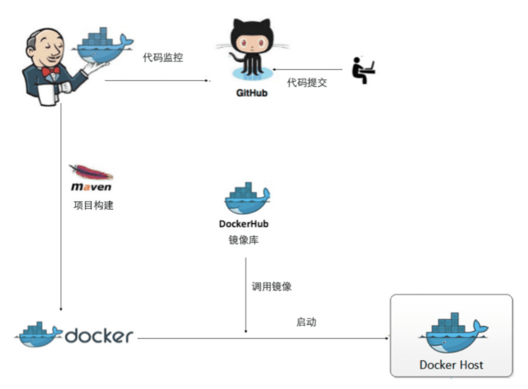

# 一、背景
近几年，伴随着前端技术日新月异的发展，服务开发中前后端分离，工程化，自动化等现代化的开发模式越来普及，项目已经进入了编译、构建、单元测试等现代软件工程化的标准环节。这样大提高了软件的开发效率和业务交付能力。但是在代码集成、项目部署阶段，我们还需要引入 CI / CD 等现代化的软件开发实践，来减少风险和重复过程，节省我们的时间。

持续部署（CD）是指的是代码通过评审以后,⾃动部署到开发、测试、生产环境。

持续部署的目标是代码在任何时刻都是可部署的，可以进⼊生产阶段。

持续部署的前提是能⾃动化完成测试、构建、部署等步骤。

# 二、技术方案
DevOps平台基于GitLab、Jenkins、Docker、Kubernetes完成整套持续部署方案。

**整体流程如下图：** 

1. **代码提交：** 用户将代码PUSH到Git仓库（GitLab、GitHub）；
1. **Git仓库：** Git仓库收到代码提交事件后，通过WebHook机制出发Jenkins的构建流程；
1. **打包构建：** Jenkins通过Maven、NodeJS等构建工具对代码进行编译、打包并上传到镜像仓库（DockerHub、Nexus、Harbor）中；
1. **部署：** 应用程序打包后Jenkins通过调用Docker、Kubernetes对应的API进行部署操作。

