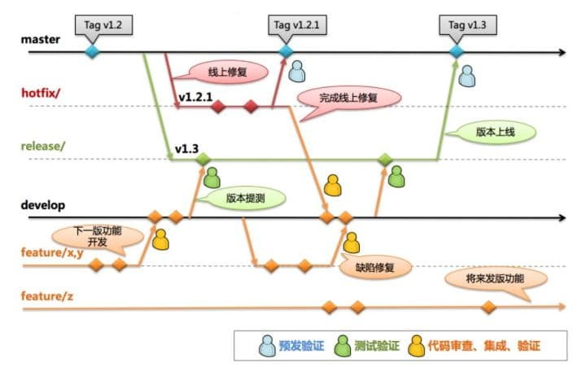
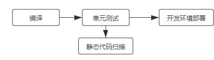

# 一、背景
随着软件产业的不断发展，软件缺陷成为制约软件质量的关键因素。如何管理和跟踪在测试和使用过程中发现的软件缺陷，对于提高缺陷修复效率具有一定的现实意义。目前软件缺陷管理存在平台迁移困难，数据迁移困难，导入导出资源困难，对于缺陷没有可视化图表展示等问题。

以往在非 CI （持续集成）环境中，人们针对软件项目，主要采用的是主干-分支（trunk-branch）式的版本控制。开发人员长期在分支上开发各种功能。随着时间的推移，他们在将自己的变更与其他开发人员集成时，往往会不知不觉地让分支偏离了主干。

因此，为了确保所有的变更都能兼容生产系统，开发人员往往在整合分支功能的过程中苦不堪言，他们甚至创造了短语--“整合地狱（integration hell）”。

如今，CI 的工作流程正好能够通过轻松、例行的集成方式，解决这个问题。

# 二、技术方案
DevOps平台使用 Git 作为版本库，Jenkins 进行持续集成，使团队成员能够良好地协作，针对需求的变更能良好地应对，系统的质量也在一定程度上得到了提高。在缺陷管理系统中使用持续集成框架，对项目代码进行测试，及时发现系统缺陷，同时减少系统的潜在缺陷。

DevOps平台中持续集成的基础是合适的分支策略，Git Flow 是很多基于 Git 版本控制系统的项目所实践的一种开发流程，它基本能够满足很多项目：

- 在开发新功能/任务时，开发人员从当前**集成develop分支** checkout一个**功能开发feature分支** ；

- 在feature分支上进行功能开发和自测，当有新的commit提交到分支上时，持续集成系统会从feature分支上拉取代码进行编译、单元测试、静态代码扫描等，然后自动化部署到开发环境进行冒烟测试，便于开发人员尽早验证已开发的功能；

    
    
    

- 如果验证通过，并确定本迭代能上线的，开发团队可以将feature分支合并到develop分支，并删除feature分支，然后进行下一个feature的开发；

- develop分支的代码更新也会触发对应流水线的集成，持续集成系统会从develop分支上拉取代码进行编译，然后同样地进行单元测试、静态代码扫描、自动化测试等，最后自动化部署到测试环境供测试团队（QA）进行测试；

- 上线当天由本迭代**上线负责人** 从master分支创建**release发版验证分支** ，由上线负责人将集成develop分支合入release分支。持续集成系统会基于release分支进行新的构建、测试并在经过人工审核后部署到预发环境，在预发环境进行演练和回归测试；

- 演练完成，确定可以上线的，由**上线负责人** 将**release分支** 合入**master分支** 并打**Tag** ，准备上线；持续集成系统会基于Tag来拉取代码进行新的构建、并在人工审核后发布到线上。

上面的流程基本能够满足很多项目的开发以及持续集成流程，持续集成是一种软件开发实践，而实践不是工程，是不可全盘复制的，我们必须围绕持续集成的思想来打造符合我们项目实际情况的实践。

