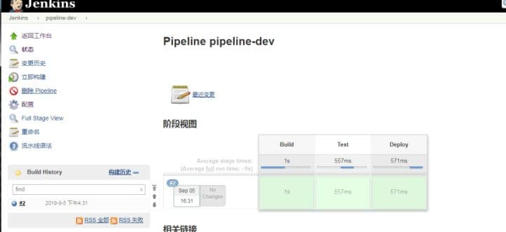

# 一、背景
一个持续交付（CD）管道是一直到你的用户和客户的过程正从版本控制软件的自动化表达。对软件的每次更改（在源代码管理中提交）都会在发布的过程中经历一个复杂的过程。此过程涉及以可靠且可重复的方式构建软件，以及通过多个测试和部署阶段推进构建的软件（称为“构建”）。

在整个流程里，我们需要一系列可扩展的工具对简单到复杂的传输管道进行建模 。

# 二、技术方案

## 2.1、Pipline 的组成

Jenkins Pipeline（或简称为“Pipeline”，大写字母为“P”）是一套插件，支持在Jenkins中实现和集成连续交付管道。

对Jenkins 流水线的定义被写在一个文本文件中 (成为 [`Jenkinsfile`](https://www.jenkins.io/zh/doc/book/pipeline/jenkinsfile)，该文件可以被到项目的源代码的控制仓库。 这是“流水线即代码”的基础；将 CD 流水线作为应用程序的一部分，像其他代码一样进行版本化和审查。 创建 `Jenkinsfile` 并提交它到源代码控制中提供了一些即时的好处：

- 自动地为所有分支创建流水线构建过程并拉取请求

- 在流水线上代码复查/迭代 (以及剩余的源代码)

- 对流水线进行审计跟踪

- 该流水线的真正的源代码, 可以被项目的多个成员查看和编辑

While定义流水线的语法, 无论是在 web UI 还是在 `Jenkinsfile` 中都是相同的, 通常认为在 `Jenkinsfile` 中定义并检查源代码控制是最佳实践。

## 2.2、**为什么要使用 pipeline ？** 

**Pipeline 五大特性** 

**代码: ** Pipeline 以代码的形式实现，通常被检入源代码控制，使团队能够编辑、审查和迭代其 CD 流程。

**可持续性：** Jenklins 重启或者中断后都不会影响 Pipeline Job。

**停顿：** Pipeline 可以选择停止并等待任工输入或批准，然后再继续 Pipeline 运行。

**多功能：** Pipeline 支持现实世界的复杂 CD 要求，包括 fork/join 子进程，循环和并行执行工作的能力

**可扩展：** Pipeline 插件支持其 DSL 的自定义扩展以及与其他插件集成的多个选项。

## 2.3、**Pipeline 的语法**
-　Declarative 声明式
-　Scripted pipeline 脚本式
## 2.4、**Pipline Declarative 格式**

```
pipeline {
    agent any 
    stages {
        stage('Build') { 
            steps {
                sh 'echo Build'
            }
        }
        stage('Test') { 
            steps {
                sh 'echo Test'
            }
        }
        stage('Deploy') { 
            steps {
                sh 'echo Deploy'
            }
        }
    }
}
```

**pipeline：代表整条流水线，包含整条流水线的逻辑。** 

- **stages 部分：流水线中多个 stage 的容器。stages 部分至少包含一个stage。** 
- **stage 部分：阶段，代表流水线的阶段。每个阶段都必须有名称。本例中，build 就是此阶段的名称。** 
- **steps 部分：代表阶段中的一个或多** 



## 2.5、**Scripted Pipeline** 

Scripted Pipeline对语法的要求比较宽松，顶层可以是 node，也可以是stage。node 可以嵌套stage，stage 反过来也可以嵌套 node。典型的脚本式 Pipeline 语法如下：

```
node {   //node可以指定label 例如 node ('label_name') {}
    stage("Build") {
        sh 'echo Building...'
    }
 
    stage("Test"){
        sh 'echo Testing...'
    }
}
```

## 2.6、**Pipline Declarative 参数详解** 

```
pipeline {
    agent any
    options { 
        buildDiscarder(logRotator(numToKeepStr: '1')) 
        timeout(time: 1, unit: 'HOURS') 
    }
    parameters {
        string(name: 'example', defaultValue: 'this is example', description: 'this  is  description')
    }
    environment {
        NODEJS_HOME = "${tool 'nodejs'}"
		PATH="${env.NODEJS_HOME}/bin:${env.PATH}"
}
tools {
            maven 'maven-3'    //这里是全局工具配置的名字,要对应
            nodejs "nodejs"     //这里是全局工具配置的名字,要对应
            gradle "Gradle"      //这里是全局工具配置的名字,要对应
}
    stages {
        stage('Example') {
            steps {
                echo "$NODEJS_HOME"
                echo 'Hello World'
                echo "Hello ${params.example}"
sh 'mvn --version'
sh 'node --version'
            }
        }
    }
    post { 
        always { 
            echo 'I will always say Hello again!'
        }
    }
}
```

有效的Declarative Pipeline必须包含在一个pipeline块内，例如：

pipeline { /* insert Declarative Pipeline here */ }

**①.** **agent** 

**agent部分指定整个Pipeline或特定阶段将在Jenkins环境中执行的位置，具体取决于该agent 部分的放置位置。该部分必须在pipeline块内的顶层定义** 

参数:

none： 当在pipeline块的顶层使用none时，将不会为整个Pipeline运行分配全局agent ，每个stage部分将需要包含其自己的agent部分。

label: 使用提供的label标签，在Jenkins环境中可用的代理上执行Pipeline或stage。例如：agent { label 'my-defined-label' }

node: agent { node { label 'labelName' } }，等同于 agent { label 'labelName' }，但node允许其他选项（如customWorkspace）。

docker: 定义此参数时，执行Pipeline或stage时会动态供应一个docker节点去接受Docker-based的Pipelines。 docker还可以接受一个args，直接传递给docker run调用。例如：agent { docker 'maven:3-alpine' }或

**②.** **stages部分** 

流水线中多个stage的容器。stages部分至少包含一个stage。

**③.** **stage部分** 

阶段，代表流水线的阶段。每个阶段都必须有名称。本例中，build就是此阶段的名称。

**④.** **steps部分** 

代表阶段中的一个或多

**⑤.** **发布 post** 

post定义将在Pipeline运行或stage结束时运行的操作。一些条件后的块的内支持post： always，changed，failure，success，unstable，和aborted。这些块允许在Pipeline运行或stage结束时执行步骤，具体取决于Pipeline的状态。

参数:

always: 无论Pipeline运行的完成状态如何都会运行。

changed: 只有当前Pipeline运行的状态与先前完成的Pipeline的状态不同时，才能运行。

failure: 仅当当前Pipeline处于“失败”状态时才运行，通常在Web UI中用红色指示表示。

success: 仅当当前Pipeline具有“成功”状态时才运行，通常在具有蓝色或绿色指示的Web UI中表示。

unstable: 只有当前Pipeline具有“不稳定”状态，通常由测试失败，代码违例等引起，才能运行。通常在具有黄色指示的Web UI中表示。

aborted: 只有当前Pipeline处于“中止”状态时，才会运行，通常是由于Pipeline被手动中止。通常在具有灰色指示的Web UI中表示。

cleanup: 无论管道或stage的状态如何，在跑完所有其他的post条件后运行此条件下 的post步骤

**⑥.** **Environment** 

指令指定一系列键值对，这些键值对将被定义为所有step或特定stage的step的环境变量，具体取决于environment指令位于Pipeline中的位置。

**⑦.** **Options** 

指令允许在Pipeline内配置Pipeline专用选项。Pipeline提供了许多这些选项，例如buildDiscarder，但它们也可能由插件提供，例如 timestamps。

可用选项

buildDiscarder : 持久化工件和控制台输出，用于保存Pipeline最近几次运行的数据。

例如：options { buildDiscarder(logRotator(numToKeepStr: '1')) }

checkoutToSubdirectory: 在工作区的子目录中执行源代码检出。

例如：options { checkoutToSubdirectory('foo') }

disableConcurrentBuilds: 不允许并行执行Pipeline。可用于防止同时访问共享资源等。

例如：options { disableConcurrentBuilds() }

preserveStashes: 保留已完成构建的存储，用于stage重新启动。

例如：options { preserveStashes() }

保存最近完成的构建中的stash，或者

options { preserveStashes(5) }

保留最近五个完成的构建中的stash。

quietPeriod: 设置管道的静默期（以秒为单位），覆盖全局默认值。

例如：options { quietPeriod(30) }

retry: 如果失败，请按指定的次数重试整个管道。

例如：options { retry(3) }

skipDefaultCheckout: 在agent指令中默认跳过源代码检出。

例如：options { skipDefaultCheckout() }

skipStagesAfterUnstable: 一旦构建状态进入了“不稳定”状态，就跳过stage。

例如：options { skipStagesAfterUnstable() }

timeout: 设置Pipeline运行的超时时间，之后Jenkins应该中止Pipeline。

例如：options { timeout(time: 1, unit: 'HOURS') }

timestamps: 当执行时，预处理由Pipeline生成的所有控制台输出运行时间。

例如：options { timestamps() }

**⑧.** **parameters** 

**parameters指令提供用户在触发Pipeline时应提供的参数列表。这些用户指定的参数的值通过该params对象可用于Pipeline步骤** 

可用参数

string: 字符串类型的参数

例如:parameters { string(name: 'DEPLOY_ENV', defaultValue: 'staging', description: '') }

文本: 一个text参数，可以包含多行

例如： parameters { text(name: 'DEPLOY_TEXT', defaultValue: 'One\nTwo\nThree\n', description: '') }

booleanParam： 一个布尔参数，例如：

parameters { booleanParam(name: 'DEBUG_BUILD', defaultValue: true, description: '') }

choice: 选择参数

例如： parameters { choice(name: 'CHOICES', choices: ['one', 'two', 'three'], description: '') }

file: 一个文件参数，指定用户在计划构建时要提交的文件

例如： parameters { file(name: 'FILE', description: 'Some file to upload') }

password: 密码参数

例如： parameters { password(name: 'PASSWORD', defaultValue: 'SECRET', description: 'A secret password') }

**⑨.** **工具 tools（用的比较多）** 

定义自动安装和放置工具的部分PATH。如果指定agent none，这将被忽略。

支持的工具

maven

jdk

Gradle

nodejs

## 2.7、**Pipline 支持的指令**
Jenkins pipeline支持的指令有：

- environment：用于设置环境变量，可定义在stage或pipeline部分。

- tools：可定义在pipeline或stage部分。它会自动下载并安装我们指定的工具，并将其加入PATH变量中。

- input：定义在stage部分，会暂停pipeline，提示你输入内容。

- options：用于配置Jenkins pipeline本身的选项，比如options 2次。options指令可定义在stage或pipeline部分。

- parallel：并行执行多个step。在pipeline插件1.2版本后，parallel开始支持对多个阶段进行并行执行。

- parameters：与input不同，parameters是执行pipeline前传入的一些参数。

- triggers：用于定义执行pipeline的触发器。

- when：当满足when定义的条件时，阶段才执行。

在使用指令时，需要注意的是每个指令都有自己的“作用域”。如果指令使用的位置不正确，Jenkins将会报错

## 2.8、**pipeline中使用脚本**
```
pipeline {
    agent any 
    stages {
        stage('Build') { 
            steps {
                sh 'echo Build'
            }
        }
        stage('Test') { 
            steps {
                sh 'echo Test'
            }
        }
        stage('Deploy') { 
            steps {
                script {
                    echo "$num"
                    if ( "$num" == '0' ) {
                        echo "ok"
                    }else {
                        echo "Error"
                    }
                }            
                
            }
        }
        
    }
}
```
传入参数num 如果 等于0 打印ok 否则 打印_Error_