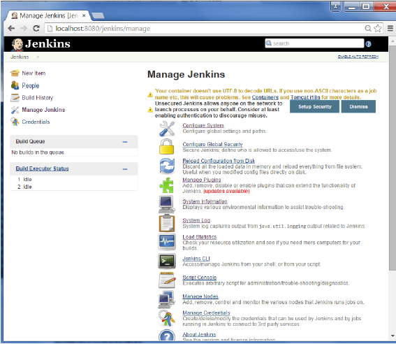
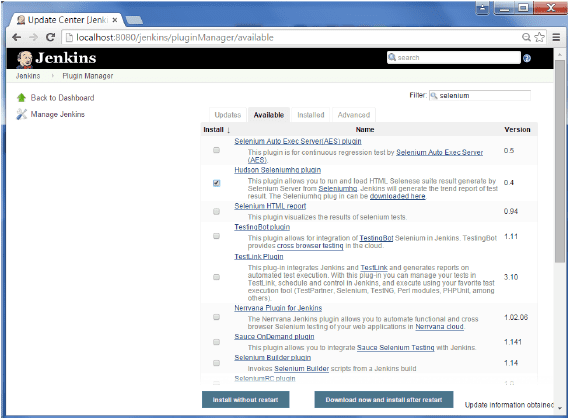
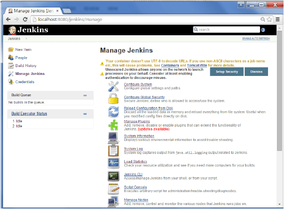
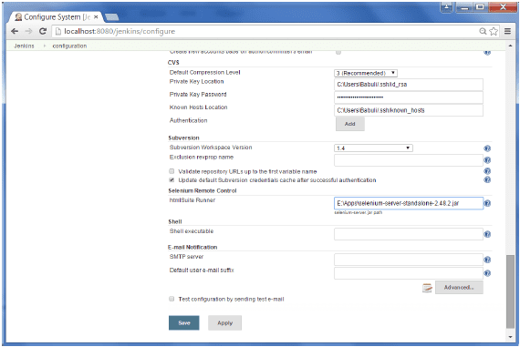
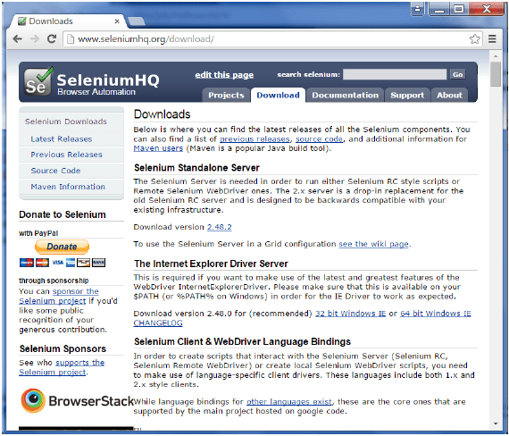
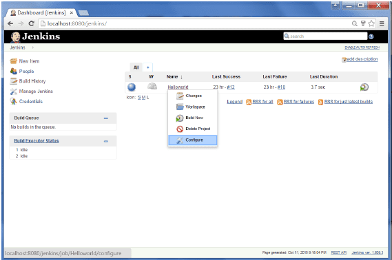
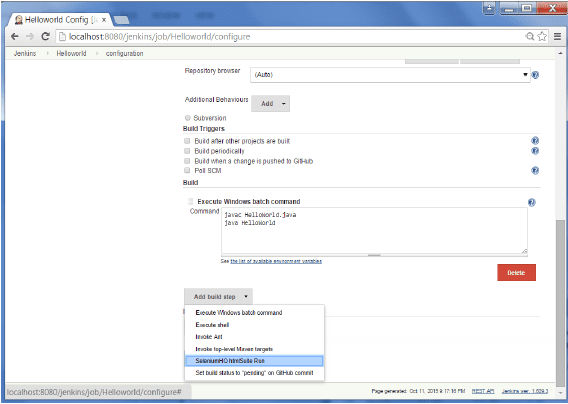
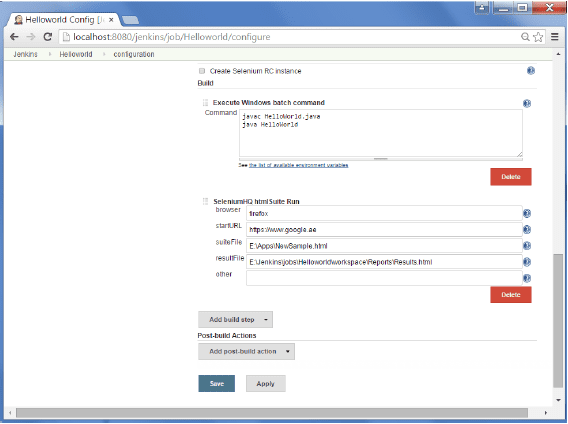

# 一、背景

个持续集成的基本原则是构建应该是可验证的。你必须能够客观地确定一个特定的构建是否准备就绪构建过程的下一个阶段，最便捷的方式做到这一点是使用自动化测试。如果没有适当的自动化测试，会发现自己不得不保留许多手动生成工件，这几乎是在持续手工进行集成测试。

# 二、方案介绍

DevOps 平台使用 Jenkins + Selenium 进行自动化测试。当代码构建完毕后可以通过相应的Jenkins配置执行自动化测试流程。

## Jenkins + Selenium 配置

### 1 进入管理插件。 	

### 2 找到 Hudson Selenium 插件并选择安装。重新启动 Jenkins 实例。 	

### 3 转到配置系统。 	

### 4 配置硒服务器 jar，然后点击保存(Save)按钮。

注 - Selenium jar文件可下载SeleniumHQ：[点击下载Selenium](http://www.seleniumhq.org/download/) 的独立服务器。

### 5 返回到仪表板，然后单击配置 (Configure) 选项 HelloWorld 项目。 	

### 6 点击添加构建步骤，并选择“SeleniumHQ htmlSuite Run”选项。 	

	

### 7 添加必要的细节 selenium 测试。

在这里，suiteFile是使用selenium IDE生成TestSuite。点击保存(Save)并执行构建。现在后生成将启动 selenium 驱动程序，并执行HTML测试。

