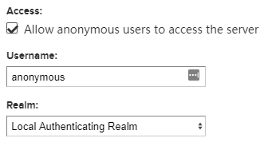
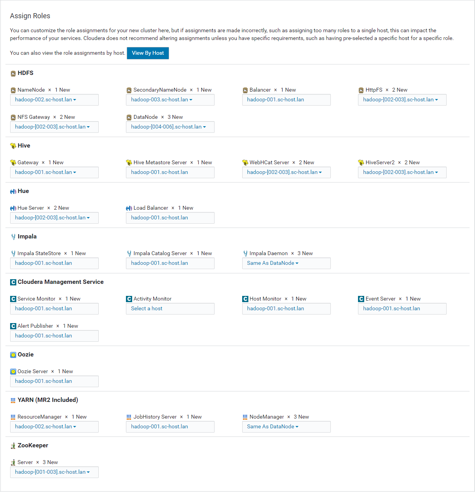
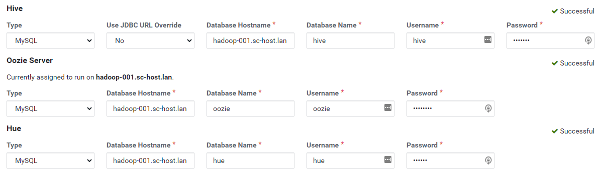

# 版本信息
**CentOS:** 7.8
**Cloudera Manager: **6.3.2
**CDH: **6.3.1
**Mariadb:** 5.5
**JDK:** Oracle JDK 1.8_181


**注意：**Cloudera Manager 在从6.3.3版本开始不在提供Express（免费）版本，所以我们只能选择6.3.2
# 服务器与角色
| **主机名** | **角色** |
| :---: | :---: |
| hadoop-001.sc-host.lan | Master-3，Utility-1 |
| hadoop-002.sc-host.lan | Master-1 |
| hadoop-003.sc-host.lan | Master-2 |
| hadoop-004.sc-host.lan | Worker |
| hadoop-005.sc-host.lan | Worker |
| hadoop-006.sc-host.lan | Worker |

**角色对应的组件列表参考官方文档：**

[Recommended Cluster Hosts and Role Distribution ( 3 - 20 Worker Hosts with High Availabilit )](https://docs.cloudera.com/documentation/enterprise/6/latest/topics/cm_ig_host_allocations.html#concept_f43_j4y_dw__section_dn3_ngj_ndb)

# 服务器额外配置
## 禁用大页缓存
在所有 Hadoop 服务上执行以下语句
```bash
echo never > /sys/kernel/mm/transparent_hugepage/enabled
echo never > /sys/kernel/mm/transparent_hugepage/defrag

cat <<'EOF'> /etc/rc.d/rc.local

# 禁用大页缓存提升性能（For Hadoop）
echo never > /sys/kernel/mm/transparent_hugepage/enabled
echo never > /sys/kernel/mm/transparent_hugepage/defrag
EOF
```
## 安装 Cloudera Manager
## 配置 YUM 代理服务器（Nexus3 OSS）
### 配置 YUM 仓库
#### Clouder Manager
Repositories > Create Repository > yum (proxy)
```yaml
Name: yum-cm-6.3.1
Proxy:
	Remote Storage: https://archive.cloudera.com/cm6/6.3.1/redhat7/yum/
```
#### CDH
Repositories > Create Repository > yum (proxy)
```yaml
Name: yum-cdh-6.3.2
Proxy:
	Remote Storage: https://archive.cloudera.com/cdh6/6.3.2/redhat7/yum/
```
### 配置仓库组
Repositories > Create Repository > yum (group)
```yaml
Name: yum-cloudera
Group:
	Member repositories: 
  	members: 
    	- yum-cm-6.3.1
      - yum-cdh-6.3.2
```
## 设置匿名访问
Security > Anonymous Access



## 在所有节点上添加 YUM 源
```bash
cat <<'EOF'> /etc/yum.repos.d/cloudera-nexus3.repo 
[cloudera-nexus3]
name=cloudera-nexus3
baseurl=http://nexus3.sc.lan/repository/yum-cloudera/
enabled=1
gpgcheck=0
EOF

yum clean makecache
```
## 安装 JDK
```bash
# cloudera提供的YUM源中提供了最合适的JDK，所以我们直接使用yum安装
# 如果碰到 28, 'Operation too slow. Less than 1000 bytes/sec transferred the last 30 seconds'
# 请稍等一会儿，是代理仓库还未下载完毕
yum -y install oracle-j2sdk1.8

# 创建软连
ln -sf /usr/java/jdk1.8.0_181-cloudera/ /usr/java/default

# 配置JAVA环境变量
cat <<'EOF'> /etc/profile.d/java.sh
JAVA_HOME=/usr/java/default
CLASSPATH=.:$JAVA_HOME/lib/dt.jar:$JAVA_HOME/lib/tools.jar
PATH=$JAVA_HOME/bin:$PATH
EOF

# 刷新一下
source /etc/profile
```
## 安装 Cloudera Manager 相关组件
### 安装 daemons、agent 组件（所有节点执行）
```bash
yum -y install cloudera-manager-agent 
```
### 安装 server 组件（hadoop-001节点执行）
```bash
yum -y install cloudera-manager-server
```
## 安装、配置数据库
### 安装 MariaDB

- 自行修改 **MARIADB_DATA_DIR** 位置
```bash
yum -y install mariadb-server

# 数据库存储路径，自行设置
MARIADB_DATA_DIR=/mnt/vdb/mariadb-data

mkdir ${MARIADB_DATA_DIR}
chown -R mysql:mysql ${MARIADB_DATA_DIR}

cat <<EOF> /etc/my.cnf
[mysqld]
datadir="${MARIADB_DATA_DIR}"
socket=/var/lib/mysql/mysql.sock
transaction-isolation = READ-COMMITTED
# Disabling symbolic-links is recommended to prevent assorted security risks;
# to do so, uncomment this line:
symbolic-links = 0
# Settings user and group are ignored when systemd is used.
# If you need to run mysqld under a different user or group,
# customize your systemd unit file for mariadb according to the
# instructions in http://fedoraproject.org/wiki/Systemd

key_buffer = 32M
# (deprecated) key_buffer_size = 32M
max_allowed_packet = 32M
thread_stack = 256K
thread_cache_size = 64
query_cache_limit = 8M
query_cache_size = 64M
query_cache_type = 1

max_connections = 550
#expire_logs_days = 10
#max_binlog_size = 100M

#log_bin should be on a disk with enough free space.
#Replace '/var/lib/mysql/mysql_binary_log' with an appropriate path for your
#system and chown the specified folder to the mysql user.
log_bin=/var/lib/mysql/mysql_binary_log

#In later versions of MariaDB, if you enable the binary log and do not set
#a server_id, MariaDB will not start. The server_id must be unique within
#the replicating group.
server_id=1

binlog_format = mixed

read_buffer_size = 2M
read_rnd_buffer_size = 16M
sort_buffer_size = 8M
join_buffer_size = 8M

# InnoDB settings
innodb_file_per_table = 1
innodb_flush_log_at_trx_commit  = 2
innodb_log_buffer_size = 64M
innodb_buffer_pool_size = 4G
innodb_thread_concurrency = 8
innodb_flush_method = O_DIRECT
innodb_log_file_size = 512M

[mysqld_safe]
log-error=/var/log/mariadb/mariadb.log
pid-file=/var/run/mariadb/mariadb.pid

#
# include all files from the config directory
#
!includedir /etc/my.cnf.d
EOF
```
### 初始化配置
```bash
# 执行
/usr/bin/mysql_secure_installation
```
```
[...]
Enter current password for root (enter for none):
OK, successfully used password, moving on...
[...]
Set root password? [Y/n] Y
New password:
Re-enter new password:
[...]
Remove anonymous users? [Y/n] Y
[...]
Disallow root login remotely? [Y/n] N
[...]
Remove test database and access to it [Y/n] Y
[...]
Reload privilege tables now? [Y/n] Y
[...]
All done!  If you've completed all of the above steps, your MariaDB
installation should now be secure.

Thanks for using MariaDB!
```
### 安装 JDBC 驱动

- 此步骤在所有需要连接数据库的服务器上执行（hadoop-001、hadoop-002、hadoop-003）
```bash
cd /tmp
wget https://dev.mysql.com/get/Downloads/Connector-J/mysql-connector-java-5.1.46.tar.gz
tar zxvf mysql-connector-java-5.1.46.tar.gz
sudo mkdir -p /usr/share/java/
cd mysql-connector-java-5.1.46
sudo cp mysql-connector-java-5.1.46-bin.jar /usr/share/java/mysql-connector-java.jar
```
### 创建数据库
**登录**
```bash
mysql -uroot -p
```
**创建数据库**
```sql
CREATE DATABASE scm DEFAULT CHARACTER SET utf8 DEFAULT COLLATE utf8_general_ci;
GRANT ALL ON scm.* TO 'scm'@'%' IDENTIFIED BY 'scm123';

CREATE DATABASE hue DEFAULT CHARACTER SET utf8 DEFAULT COLLATE utf8_general_ci;
GRANT ALL ON hue.* TO 'hue'@'%' IDENTIFIED BY 'hue123';

CREATE DATABASE hive DEFAULT CHARACTER SET utf8 DEFAULT COLLATE utf8_general_ci;
GRANT ALL ON hive.* TO 'hive'@'%' IDENTIFIED BY 'hive123';

CREATE DATABASE oozie DEFAULT CHARACTER SET utf8 DEFAULT COLLATE utf8_general_ci;
GRANT ALL ON oozie.* TO 'oozie'@'%' IDENTIFIED BY 'oozie123';
```
### 初始化数据库
```bash
# 使用 cloudera manager 提供的初始化脚本进行数据库初始化
# /opt/cloudera/cm/schema/scm_prepare_database.sh [options] (postgresql|mysql|oracle) database username [password]
/opt/cloudera/cm/schema/scm_prepare_database.sh mysql scm scm
```
```
Enter SCM password: 
JAVA_HOME=/usr/java/jdk1.8.0_181-cloudera
Verifying that we can write to /etc/cloudera-scm-server
Creating SCM configuration file in /etc/cloudera-scm-server
Executing:  /usr/java/jdk1.8.0_181-cloudera/bin/java -cp /usr/share/java/mysql-connector-java.jar:/usr/share/java/oracle-connector-java.jar:/usr/share/java/postgresql-connector-java.jar:/opt/cloudera/cm/schema/../lib/* com.cloudera.enterprise.dbutil.DbCommandExecutor /etc/cloudera-scm-server/db.properties com.cloudera.cmf.db.
[                          main] DbCommandExecutor              INFO  Successfully connected to database.
```
# 安装 Cloudera Manager 组件
## 启动 Cloudera Manager Server
```bash
 systemctl start cloudera-scm-server
 systemctl enable cloudera-scm-server
```
## 配置 Cloudera Manager
通过浏览器进入 [http://hadoop-001.sc-host.lan:7180/](http://hadoop-001.sc-host.lan:7180/)，初始帐号密码均为 admin
## Welcome to Cloudera Manager

- **Welcome：**continue
- **Accept License：**Yes, I accept the End User License Terms and Conditions. > continue
- **Select Edition：**Cloudera Express > continue
## Add Cluster - Installation

- **Specify Hosts**

**Hostname：**hadoop-[001-006].sc-host.lan
**SSH Port：**22
点击 Search > 勾选主机 > Continue
**注意：**如果发现 Hostname 中显示的内容与服务器hostname 不一致的情况，请查看服务器的 /etc/hosts 文件，确认是否配置了额外的映射，删除即可。

- **Select Repository**

**Cloudera Manager Agent：**Public Cloudera Repository
**CDH and other software：**全默认即可，配置 Proxy Settings 加速下载**

- **Accept JDK License**

不勾选 > Continue

- **Enter Login Credentials**

输入并确认root密码 > Continue
**注意：**这里的root密码指的所有服务器共同的的root密码

- **Inspect Cluster**

**依次点击：**Inspect Network Performance / Inspect Hosts
## Add Cluster - Configuration

- **Select Services：**Data Warehouse
- **Assign Roles:**



- **Setup Database**

填入之前配置的数据库相关信息并点击测试



- **Review Changes**

dfs.blocksize: 256mb
# 配置 HDFS 高可用
**Clusters > HDFS > Actions > Enable High Availability**

- **Assign Roles**

**NameNode Hosts：**hadoop-002、hadoop-003
**JournalNode Hosts：**hadoop-001、hadoop-002、hadoop-003

- **Review Changes**

**JournalNode Edits Directory：**/mnt/vdb/dfs/jn
# 升级 Hive Metastore NameNode 配置

- Clusters > HIVE> Actions > Stop
- Clusters > HIVE> Actions > Update Hive Metastore NameNodes
- Clusters > HIVE> Actions > Start
# 配置 YARN 高可用
**Clusters > YARN > Actions > Enable High Availability**

- **Getting Started**

**ResourceManager Hosts：**hadoop-002、hadoop-003