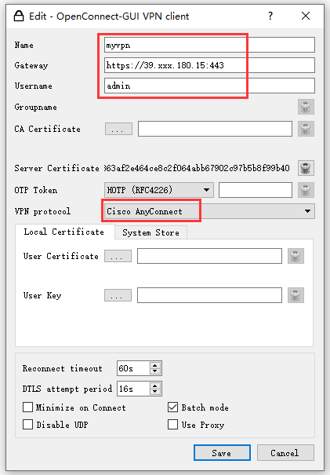

# 安装


```bash
# 安装相关组件
yum -y install ocserv dnsmasq
systemctl enable --now dnsmasq
```


**备注：**VPN客户端无法正常跟目标内网网段中的DNS进行交互。需要在 VPN 服务器上搭建一个DNSMasq服务进行转发，然后使用服务器的VPN网段IP作为DNS服务器的IP，填写到ocserv配置文件中。
# 配置


```bash
# 修改VPN配置
vim /etc/ocserv/ocserv.conf
-----------------------------------------
# 使用帐号密码模式进行认证
auth = "plain[/etc/ocserv/ocpasswd]"

# 不限制客户端连接数量
max-clients = 0

# 不限制相同帐号的连接数量
max-same-clients = 0

# 重试打分，不限制
max-ban-score = 0

# 设置VPN 网段（注意网段不要冲突）
ipv4-network = 10.211.126.0
ipv4-netmask = 255.255.255.0

# 推送DNS，DNS地址使用我们VPN服务器的VPN网段IP
tunnel-all-dns = true
dns = 10.211.126.1

# 设置需要路由的网段
route = 172.26.0.0/16
```


```bash
systemctl enable --now ocserv
```
# 添加用户
```bash
# 示例： 添加一个admin用户
ocpasswd -c /etc/ocserv/ocpasswd admin
```
# 如何使用
下载 [openconnect-gui](https://openconnect.github.io/openconnect-gui/)
添加一个链接，并填入VPN相关信息，连接即可



连接完毕后在本机 ping 一下内网服务器的IP地址（路由网段  内的IP），确认连接是否正常