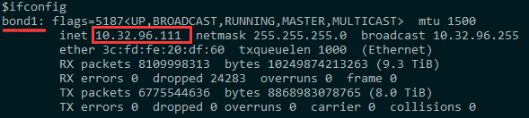

# 背景
由于外网固定IP需要收费，以及考虑到安全风险，我们不会将每台服务器都配置外网IP。但是其它内网服务器却有外网访问需求。这时我们可以搭建一台网关服务器来满足内网服务器的外网访问需求。
# 服务器要求

- 由于我们没有使用路由器、交换机的额外功能。在这种模式下我们需要访问外网的服务器跟网关服务器必须在同一个D类网段内
- 网关服务器要有外网访问权限
# 网关服务器搭建
选择一个服务器作为网关服务器，在该服务器上执行以下语句：
```bash
# 开启转发
cat <<EOF> /etc/sysctl.d/99-custom.conf
net.ipv4.ip_forward=1
EOF

yum -y install iptables-services

# 清空iptables默认配置
iptables -F

# 设置外网入站规则（其中bond0为外网网卡名）
iptables -A INPUT -i bond0 -p icmp -j ACCEPT -m comment --comment "允许ping"
iptables -A INPUT -i bond0 -p tcp --dport 22 -j ACCEPT -m comment --comment "开启SSH端口"
iptables -A INPUT -i bond0 -p tcp --dport 443 -j ACCEPT -m comment --comment "ocserv port"
iptables -A INPUT -i bond0 -m state --state  RELATED,ESTABLISHED -j ACCEPT -m comment --comment "允许接受本机请求之后的返回数据"
iptables -A INPUT -i bond0 INPUT DROP -m comment --comment "拒绝所有入站请求"

# 添加NAT伪装（网段修改成自己所在的网段,bond1为内网网卡名）
iptables -t nat -A POSTROUTING -i bond1 -s 172.16.0.0/12 -j MASQUERADE

# 保存规则配置
service iptables save

systemctl enable --now iptables
```
# 配置路由通过网关服务器访问外网
## 环境信息

- 当前我们需要访问外网的服务器IP:  `10.32.96.111` 
- 我们已经配置好的网关服务器IP:  `10.32.96.100`
- 默认网关地址：`10.32.96.254`

## 在 10.32.96.111 服务器上操作
### 确认网卡名称
通过 `ip a` 或者 `ifconfig` 命令找到内网IP对应的网卡名称



这里我们的内网网卡名称为 `bond1`

### 添加路由
```bash
vim /etc/sysconfig/network-scripts/route-bond1
---------- 添加如下信息 (注意将bond1修改成自己的网卡名称) ----------
default via 10.32.96.100 dev bond1
10.0.0.0/8 via 10.32.96.254 dev bond1
192.168.0.0/16 via 10.32.96.254 dev bond1
172.16.0.0/12 via 10.32.96.254 dev bond1
```
### 重启网卡
```bash
systemctl restart network 
```
### 校验
```bash
# 查看路由配置
route -n

# 确认网络是否能正常访问
ping 114.114.114.114
```
# 云厂商管理后台配置
云厂商提供的VPS通常需要在控制台进行路由配置
## 阿里云
VPC 专有网络 > 路由表 > 选择当前的路由表 > 添加路由条目

- **名称：**<自定义>
- **目标网段：<**网关服务器IP>
- **下一跳类型：**ECS


