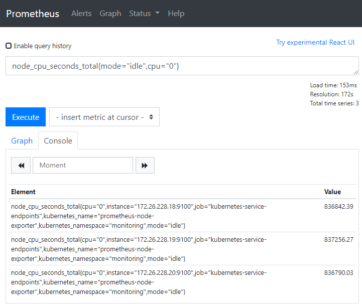

# 版本信息
**Kubernetes:** 1.18.6
# 安装 Prometheus
**Prometheus 版本:** 2.20.1
## 安装流程
### 创建 Namespace
```bash
kubectl create namespace monitoring
```
### 创建 RBAC 授权
```bash
cat <<'EOF'> prometheus-rbac.yaml
apiVersion: rbac.authorization.k8s.io/v1
kind: ClusterRole
metadata:
  name: prometheus
rules:
- apiGroups: [""]
  resources: ["nodes", "services", "endpoints","pods"]
  verbs: ["get", "list", "watch"]
- apiGroups:
  - extensions
  resources:
  - ingresses
  verbs: ["get", "list", "watch"]
- nonResourceURLs: ["/metrics"]
  verbs: ["get"]
---
apiVersion: rbac.authorization.k8s.io/v1
kind: ClusterRoleBinding
metadata:
  name: prometheus
roleRef:
  apiGroup: rbac.authorization.k8s.io
  kind: ClusterRole
  name: prometheus
subjects:
- kind: ServiceAccount
  name: default
  namespace: monitoring
EOF

kubectl apply -f prometheus-rbac.yaml
```
### 创建 Prometheus 配置文件
```bash
cat <<'EOF'> prometheus-config.yaml
apiVersion: v1
kind: ConfigMap
metadata:
  name: prometheus-config
  namespace: monitoring
data:
  prometheus.yml: |-
    global:
      scrape_interval: 15s
      evaluation_interval: 15s
      
    scrape_configs:
    - job_name: 'kubernetes-apiservers'
      kubernetes_sd_configs:
      - role: endpoints
      scheme: https
      tls_config:
        ca_file: /var/run/secrets/kubernetes.io/serviceaccount/ca.crt
      bearer_token_file: /var/run/secrets/kubernetes.io/serviceaccount/token
      relabel_configs:
      - source_labels: [__meta_kubernetes_namespace, __meta_kubernetes_service_name, __meta_kubernetes_endpoint_port_name]
        action: keep
        regex: default;kubernetes;https

    - job_name: 'kubernetes-nodes'
      scheme: https
      tls_config:
        ca_file: /var/run/secrets/kubernetes.io/serviceaccount/ca.crt
      bearer_token_file: /var/run/secrets/kubernetes.io/serviceaccount/token
      kubernetes_sd_configs:
      - role: node
      relabel_configs:
      - action: labelmap
        regex: __meta_kubernetes_node_label_(.+)

    - job_name: 'kubernetes-cadvisor'
      scheme: https
      metrics_path: /metrics/cadvisor
      tls_config:
        ca_file: /var/run/secrets/kubernetes.io/serviceaccount/ca.crt
      bearer_token_file: /var/run/secrets/kubernetes.io/serviceaccount/token
      kubernetes_sd_configs:
      - role: node
      relabel_configs:
      - action: labelmap
        regex: __meta_kubernetes_node_label_(.+)

    - job_name: 'kubernetes-service-endpoints'
      kubernetes_sd_configs:
      - role: endpoints
      relabel_configs:
      - action: labelmap
        regex: __meta_kubernetes_service_label_(.+)
      - source_labels: [__meta_kubernetes_namespace]
        action: replace
        target_label: kubernetes_namespace
      - source_labels: [__meta_kubernetes_service_name]
        action: replace
        target_label: kubernetes_name

    - job_name: 'kubernetes-services'
      metrics_path: /probe
      params:
        module: [http_2xx]
      kubernetes_sd_configs:
      - role: service
      relabel_configs:
      - source_labels: [__address__]
        target_label: __param_target
      - target_label: __address__
        replacement: blackbox-exporter.example.com:9115
      - source_labels: [__param_target]
        target_label: instance
      - action: labelmap
        regex: __meta_kubernetes_service_label_(.+)
      - source_labels: [__meta_kubernetes_namespace]
        target_label: kubernetes_namespace
      - source_labels: [__meta_kubernetes_service_name]
        target_label: kubernetes_name

    - job_name: 'kubernetes-ingresses'
      metrics_path: /probe
      params:
        module: [http_2xx]
      kubernetes_sd_configs:
      - role: ingress
      relabel_configs:
      - source_labels: [__meta_kubernetes_ingress_scheme,__address__,__meta_kubernetes_ingress_path]
        regex: (.+);(.+);(.+)
        replacement: ${1}://${2}${3}
        target_label: __param_target
      - target_label: __address__
        replacement: blackbox-exporter.example.com:9115
      - source_labels: [__param_target]
        target_label: instance
      - action: labelmap
        regex: __meta_kubernetes_ingress_label_(.+)
      - source_labels: [__meta_kubernetes_namespace]
        target_label: kubernetes_namespace
      - source_labels: [__meta_kubernetes_ingress_name]
        target_label: kubernetes_name

    - job_name: 'kubernetes-pods'
      kubernetes_sd_configs:
      - role: pod
      relabel_configs:
      - action: labelmap
        regex: __meta_kubernetes_pod_label_(.+)
      - source_labels: [__meta_kubernetes_namespace]
        action: replace
        target_label: kubernetes_namespace
      - source_labels: [__meta_kubernetes_pod_name]
        action: replace
        target_label: kubernetes_pod_name
EOF

kubectl apply -f prometheus-config.yaml
```
### 部署 Prometheus
```bash
cat <<'EOF'> prometheus-deploy.yaml
apiVersion: apps/v1
kind: Deployment
metadata:
  name: prometheus
  namespace: monitoring
spec:
  replicas: 1
  selector:
    matchLabels:
      app: prometheus-server
  template:
    metadata:
      labels:
        app: prometheus-server
    spec:
      containers:
        - name: prometheus
          image: prom/prometheus:v2.20.1
          args:
            - "--config.file=/etc/prometheus/prometheus.yml"
            - "--storage.tsdb.path=/prometheus/"
          ports:
            - containerPort: 9090
          volumeMounts:
            - name: prometheus-config-volume
              mountPath: /etc/prometheus/
            - name: prometheus-storage-volume
              mountPath: /prometheus/
      volumes:
        - name: prometheus-config-volume
          configMap:
            defaultMode: 420
            name: prometheus-config
        - name: prometheus-storage-volume
          emptyDir: {}
          
---
apiVersion: v1
kind: Service
metadata:
  name: prometheus-server
  namespace: monitoring
  annotations:
      prometheus.io/scrape: 'true'
      prometheus.io/port:   '9090'
spec:
  selector:
    app: prometheus-server
  ports:
    - port: 9090
    
---
apiVersion: extensions/v1beta1
kind: Ingress
metadata:
  name: prometheus-server
  namespace: monitoring
  annotations:
    kubernetes.io/ingress.class: traefik
    traefik.ingress.kubernetes.io/router.entrypoints: web
spec:
  rules:
  - host: prometheus.k8s.sc.lan
    http:
      paths:
      - path: /
        backend:
          serviceName: prometheus-server
          servicePort: 9090
EOF

kubectl apply -f prometheus-deploy.yaml
```
## 验证
浏览器中访问 [http://prometheus.k8s.sc.lan/](http://prometheus.k8s.sc.lan/)

查询指标 

## 参考文档
[Running Prometheus on Kubernetes](https://linuxacademy.com/blog/kubernetes/running-prometheus-on-kubernetes/)

[How To Monitor Kubernetes With Prometheus](https://phoenixnap.com/kb/prometheus-kubernetes-monitoring)

# 部署 NodeExporter
NodeExporter可以将宿主机维度的相关数据暴露出来

**GitHub: **[https://github.com/prometheus/node_exporter](https://github.com/prometheus/node_exporter)

**DockerHub: **[https://hub.docker.com/r/prom/node-exporter](https://hub.docker.com/r/prom/node-exporter)

## 安装流程
```bash
cat <<'EOF'> ./prometheus-node-exporter.yaml
apiVersion: apps/v1
kind: DaemonSet
metadata:
  name: prometheus-node-exporter
  namespace: monitoring
spec:
  selector:
    matchLabels:
      name: prometheus-node-exporter
  template:
    metadata:
      name: prometheus-node-exporter
      labels:
        name: prometheus-node-exporter
    spec:
      hostNetwork: true
      hostPID: true
      containers:
      - image: prom/node-exporter:v1.0.1
        name: prometheus-node-exporter
      tolerations:
        - effect: NoSchedule
          operator: Exists
---
apiVersion: v1
kind: Service
metadata:
  annotations:
    prometheus.io/scrape: 'true'
    prometheus.io/port:   '9100'
  name: prometheus-node-exporter
  namespace: monitoring
spec:
  ports:
    - port: 9100
  selector:
    name: prometheus-node-exporter
EOF

kubectl apply -f prometheus-node-exporter.yaml
```
部署完毕后可以在节点上执行 
## 验证
NodeExporter可以提供的数据指标具体有哪些，可以在节点上使用命令 `curl http://localhost:9100/metrics` 进行查询

在 Prometheus Web UI 中查询指标 `node_cpu_seconds_total{mode="idle",cpu="0"}` 查看是否有数据



## 参考文档
[prometheus node-exporter on kubernetes](https://stackoverflow.com/questions/56959545/prometheus-node-exporter-on-kubernetes)

[https://github.com/prometheus-operator/kube-prometheus/blob/master/manifests/node-exporter-daemonset.yaml - 一个配置文件，可以学习一下](https://github.com/prometheus-operator/kube-prometheus/blob/master/manifests/node-exporter-daemonset.yaml)


# 部署 Kube-state-metrics
通过该组件可以在 Prometheus 里获取服务的资源申请数据，方便进行告警

**GitHub:** [https://github.com/kubernetes/kube-state-metrics](https://github.com/kubernetes/kube-state-metrics)

## 安装流程
### 创建RBAC授权
```bash
cat <<'EOF'> ./kube-state-metrics-rbac.yaml
apiVersion: v1
kind: ServiceAccount
metadata:
  labels:
    app.kubernetes.io/name: kube-state-metrics
    app.kubernetes.io/version: 1.9.7
  name: kube-state-metrics
  namespace: kube-system
  
---
apiVersion: rbac.authorization.k8s.io/v1
kind: ClusterRole
metadata:
  labels:
    app.kubernetes.io/name: kube-state-metrics
    app.kubernetes.io/version: 1.9.7
  name: kube-state-metrics
rules:
- apiGroups:
  - ""
  resources:
  - configmaps
  - secrets
  - nodes
  - pods
  - services
  - resourcequotas
  - replicationcontrollers
  - limitranges
  - persistentvolumeclaims
  - persistentvolumes
  - namespaces
  - endpoints
  verbs:
  - list
  - watch
- apiGroups:
  - extensions
  resources:
  - daemonsets
  - deployments
  - replicasets
  - ingresses
  verbs:
  - list
  - watch
- apiGroups:
  - apps
  resources:
  - statefulsets
  - daemonsets
  - deployments
  - replicasets
  verbs:
  - list
  - watch
- apiGroups:
  - batch
  resources:
  - cronjobs
  - jobs
  verbs:
  - list
  - watch
- apiGroups:
  - autoscaling
  resources:
  - horizontalpodautoscalers
  verbs:
  - list
  - watch
- apiGroups:
  - authentication.k8s.io
  resources:
  - tokenreviews
  verbs:
  - create
- apiGroups:
  - authorization.k8s.io
  resources:
  - subjectaccessreviews
  verbs:
  - create
- apiGroups:
  - policy
  resources:
  - poddisruptionbudgets
  verbs:
  - list
  - watch
- apiGroups:
  - certificates.k8s.io
  resources:
  - certificatesigningrequests
  verbs:
  - list
  - watch
- apiGroups:
  - storage.k8s.io
  resources:
  - storageclasses
  - volumeattachments
  verbs:
  - list
  - watch
- apiGroups:
  - admissionregistration.k8s.io
  resources:
  - mutatingwebhookconfigurations
  - validatingwebhookconfigurations
  verbs:
  - list
  - watch
- apiGroups:
  - networking.k8s.io
  resources:
  - networkpolicies
  verbs:
  - list
  - watch
- apiGroups:
  - coordination.k8s.io
  resources:
  - leases
  verbs:
  - list
  - watch
  
---
apiVersion: rbac.authorization.k8s.io/v1
kind: ClusterRoleBinding
metadata:
  labels:
    app.kubernetes.io/name: kube-state-metrics
    app.kubernetes.io/version: 1.9.7
  name: kube-state-metrics
roleRef:
  apiGroup: rbac.authorization.k8s.io
  kind: ClusterRole
  name: kube-state-metrics
subjects:
- kind: ServiceAccount
  name: kube-state-metrics
  namespace: kube-system
  
EOF

kubectl apply -f kube-state-metrics-rbac.yaml
```
### 部署
相对于官方安装文件，修改了以下信息

- 修改了image信息
- 在Service中添加了prometheus annotations

修改的部分使用 `# custom changed` 标记标出
```bash
cat <<'EOF'> kube-state-metrics-deploy.yaml
apiVersion: apps/v1
kind: Deployment
metadata:
  labels:
    app.kubernetes.io/name: kube-state-metrics
    app.kubernetes.io/version: 1.9.7
  name: kube-state-metrics
  namespace: kube-system
spec:
  replicas: 1
  selector:
    matchLabels:
      app.kubernetes.io/name: kube-state-metrics
  template:
    metadata:
      labels:
        app.kubernetes.io/name: kube-state-metrics
        app.kubernetes.io/version: 1.9.7
    spec:
      containers:
      - image: coreos/kube-state-metrics:v1.9.7 # custom changed
        livenessProbe:
          httpGet:
            path: /healthz
            port: 8080
          initialDelaySeconds: 5
          timeoutSeconds: 5
        name: kube-state-metrics
        ports:
        - containerPort: 8080
          name: http-metrics
        - containerPort: 8081
          name: telemetry
        readinessProbe:
          httpGet:
            path: /
            port: 8081
          initialDelaySeconds: 5
          timeoutSeconds: 5
        securityContext:
          runAsUser: 65534
      nodeSelector:
        kubernetes.io/os: linux
      serviceAccountName: kube-state-metrics

---
apiVersion: v1
kind: Service
metadata:
  labels:
    app.kubernetes.io/name: kube-state-metrics
    app.kubernetes.io/version: 1.9.7
  annotations:	# custom changed
    prometheus.io/scrape: 'true'
    prometheus.io/port: '8080'
  name: kube-state-metrics
  namespace: kube-system
spec:
  clusterIP: None
  ports:
  - name: http-metrics
    port: 8080
    targetPort: http-metrics
  - name: telemetry
    port: 8081
    targetPort: telemetry
  selector:
    app.kubernetes.io/name: kube-state-metrics
EOF

kubectl apply -f kube-state-metrics-deploy.yaml
```
## 验证
参考 NodeExporter 验证部分即可
## 参考文档
[官方安装文件 example/standard](https://github.com/kubernetes/kube-state-metrics/tree/master/examples/standard)

