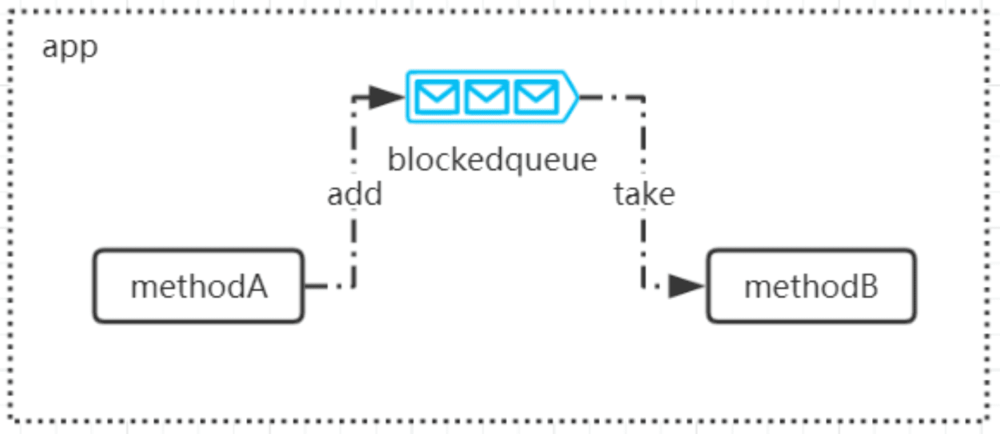
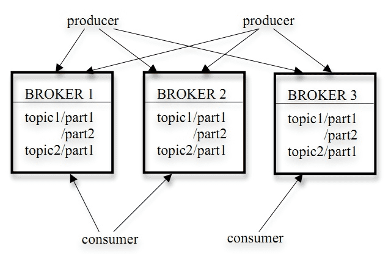
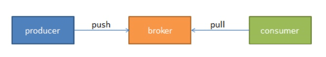
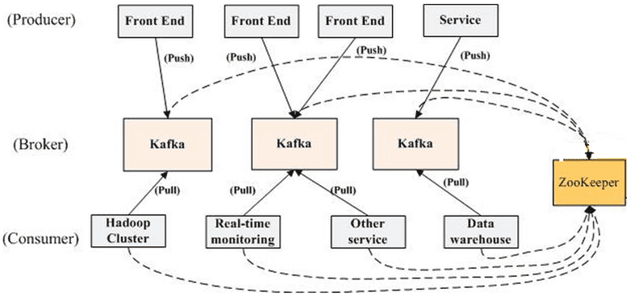

# 一、背景
我们知道并发编程中可以使用阻塞式队列+线程池来实现生产者消费者模式。比如说在一个应用中，A方法调用B方法去执行一些任务处理。我们可以同步调用。但是如果这个时候请求比较多的情况下，同步调用比较耗时会导致请求阻塞。我们会使用阻塞队列加线程池来实现异步任务处理。

那么，问题来了。如果是在分布式系统中，两个服务之间需要通过这种异步队列的方式来处理任务，那单进程级别的队列就无法解决这个问题了。

因此，引入了消息中间件，也就是把消息处理交给第三方的服务，这个服务能够实现数据的存储以及传输，使得在分布式架构下实现跨进程的远程消息通信。

所以，简单来说：消息中间件是指利用高效可靠的消息传输机制进行平台无关的数据交流，并且基于数据通信来进行分布式系统的集成。

# 二、实现方案
## 2.1 消息中间件解决方案

流行的消息队列解决方案很多：

1. **ZeroMQ：** 号称最快的消息队列，由于支持的模式特别多： TCP、IPC、inproc、Multicas，基本已经打到替代Socket的地步了。
2. **Kafka：** 是LinkedIn开源的分布式发布-订阅消息系统，目前归属于Apache定级项目。 一个消息发布订阅系统，现在常用于日志团队使用的工具，如程序将操作日志批量异步的发送到Kafka集群中，而不是保存在本地或者DB中。Kafka可以提供批量提交消息/压缩等，对Producer而言，几乎感觉不到性能的开销。Consumer可以使用Hadoop等其他系统化的存储和数据分析等。
3. **RocketMQ：** 阿里开源的一款高性能、高吞吐量的消息中间件， 纯Java开发。RocketMQ思路起源于Kafka，但并不是Kafka的一个Copy，它对消息的可靠传输及事务性做了优化，目前在阿里集团被广泛应用于交易、充值、流计算、消息推送、日志流式处理、binglog分发等场景。
4. **RabbitMQ：** RabbitMQ是一个由erlang开发的AMQP（Advanced Message Queue ）的开源实现。

## 2.2 Kafka 介绍

Kafka是由LinkedIn开发的一种分布式，基于发布 / 订阅的消息系统。使用Scala编写，它以可水平扩展和高吞吐率而被广泛使用。主要设计目标如下：

- 以时间复杂度为 O(1) 的方式提供消息持久化能力，即使对 TB 级以上数据也能保证常数时间复杂度的访问性能。
- 高吞吐率。即使在非常廉价的商用机器上也能做到单机支持每秒 100K 条以上消息的传输。
- 支持 Kafka Server 间的消息分区，及分布式消费，同时保证每个 Partition 内的消息顺序传输。
- 同时支持离线数据处理和实时数据处理。
- Scale out：支持在线水平扩展。

目前越来越多的开源分布式处理系统如Storm，Spark，Flink都支持与Kafka集成。现在我们的数据实时处理平台也使用到了kafka。现在它已被多家不同类型的公司作为多种类型的数据管道和消息系统使用。

## 2.3 为什么使用Kafka？
上面我们提到kafka是一个分布式的消息系统。那为什么要在我们的数据处理平台中使用这样的一个消息系统呢？消息系统能给我们带来什么样的好处呢？

- **解耦：** 在项目启动之初来预测将来项目会碰到什么需求，是极其困难的。消息系统在处理过程中间插入了一个隐含的、基于数据的接口层，两边的处理过程都要实现这一接口。这允许你独立的扩展或修改两边的处理过程，只要确保它们遵守同样的接口约束。
- **冗余：** 有些情况下，处理数据的过程会失败。除非数据被持久化，否则将造成丢失。消息队列把数据进行持久化直到它们已经被完全处理，通过这一方式规避了数据丢失风险。许多消息队列所采用的"插入 - 获取 - 删除"范式中，在把一个消息从队列中删除之前，需要你的处理系统明确的指出该消息已经被处理完毕，从而确保你的数据被安全的保存直到你使用完毕。
- **扩展性：** 因为消息队列解耦了你的处理过程，所以增大消息入队和处理的频率是很容易的，只要另外增加处理过程即可。不需要改变代码、不需要调节参数。扩展就像调大电力按钮一样简单。
- **灵活性 & 峰值处理能力：** 在访问量剧增的情况下，应用仍然需要继续发挥作用，但是这样的突发流量并不常见；如果为以能处理这类峰值访问为标准来投入资源随时待命无疑是巨大的浪费。使用消息队列能够使关键组件顶住突发的访问压力，而不会因为突发的超负荷的请求而完全崩溃。
- **可恢复性：** 系统的一部分组件失效时，不会影响到整个系统。消息队列降低了进程间的耦合度，所以即使一个处理消息的进程挂掉，加入队列中的消息仍然可以在系统恢复后被处理。
- **顺序保证：** 在大多使用场景下，数据处理的顺序都很重要。大部分消息队列本来就是排序的，并且能保证数据会按照特定的顺序来处理。Kafka 保证一个 Partition 内的消息的有序性。
- **缓冲：** 在任何重要的系统中，都会有需要不同的处理时间的元素。例如，加载一张图片比应用过滤器花费更少的时间。消息队列通过一个缓冲层来帮助任务最高效率的执行——写入队列的处理会尽可能的快速。该缓冲有助于控制和优化数据流经过系统的速度。
- **异步通信：** 很多时候，用户不想也不需要立即处理消息。消息队列提供了异步处理机制，允许用户把一个消息放入队列，但并不立即处理它。想向队列中放入多少消息就放多少，然后在需要的时候再去处理它们。

## 2.4 Kafka 架构

它的架构包括以下组件：

1. **话题（Topic）：** 是特定类型的消息流。消息是字节的有效负载（Payload），话题是消息的分类名或种子（Feed）名；

2. **生产者（Producer）：** 是能够发布消息到话题的任何对象；

3. **服务代理（Broker）：** 已发布的消息保存在一组服务器中，它们被称为代理（Broker）或Kafka集群；

4. **消费者（Consumer）：** 可以订阅一个或多个话题，并从Broker拉数据，从而消费这些已发布的消息；

上图中可以看出，生产者将数据发送到Broker代理，Broker代理有多个话题topic，消费者从Broker获取数据。

## 2.5 Kafka 基本原理

我们将消息的发布（publish）称作 producer，将消息的订阅（subscribe）表述为 consumer，将中间的存储阵列称作 broker(代理)，这样就可以大致描绘出这样一个场面：

生产者将数据生产出来，交给 broker 进行存储，消费者需要消费数据了，就从broker中去拿出数据来，然后完成一系列对数据的处理操作。

乍一看返也太简单了，不是说了它是分布式吗，难道把 producer、 broker 和 consumer 放在三台不同的机器上就算是分布式了吗。看 kafka 官方给出的图：

多个 broker 协同合作，producer 和 consumer 部署在各个业务逻辑中被频繁的调用，三者通过 zookeeper管理协调请求和转发。这样一个高性能的分布式消息发布订阅系统就完成了。

图上有个细节需要注意，producer 到 broker 的过程是 push，也就是有数据就 **推送** 到 broker，而 consumer 到 broker 的过程是 pull，是通过 consumer 主动去拉数据的，而不是 broker 把数据主懂发送到 consumer 端的。

## 2.6 Kafka 执行流程
首先看一下如下的过程：

我们看上面的图，我们把 broker 的数量减少，叧有一台。现在假设我们按照上图进行部署：

1. Server-1 broker 其实就是 kafka 的 server，因为 producer 和 consumer 都要去还它。 Broker 主要还是做存储用。
2. Server-2 是 zookeeper 的 server 端，它维持了一张表，记录了各个节点的 IP、端口等信息。
3. Server-3、 4、 5 他们的共同之处就是都配置了 zkClient，更明确的说，就是运行前必须配置 zookeeper的地址，道理也很简单，这之间的连接都是需要 zookeeper 来进行分发的。
4. Server-1 和 Server-2 的关系，他们可以放在一台机器上，也可以分开放，zookeeper 也可以配集群。目的是防止某一台挂了。

简单说下整个系统运行的顺序：

1. 启动zookeeper 的 server

2. 启动kafka 的 server

3. Producer 如果生产了数据，会先通过 zookeeper 找到 broker，然后将数据存放到 broker

4. Consumer 如果要消费数据，会先通过 zookeeper 找对应的 broker，然后消费

## 2.7 Kafka的特性
1. **高吞吐、低延迟：** kafka每秒可以处理几十万条消息，它的延迟最低只有几毫秒，每个topic可以分多个partition, consumer group 对partition进行consume操作；
2. **可扩展性：** kafka集群支持热扩展；
3. **持久性、可靠性：** 消息被持久化到本地磁盘，并且支持数据备份防止数据丢失；
4. **容错性：** 允许集群中节点失败（若副本数量为n,则允许n-1个节点失败）；
5. **高并发：** 支持数千个客户端同时读写；
6. **在、离线处理：** 可以使用Flink这种实时流处理系统对消息进行实时进行处理，同时还可以使用Hadoop这种批处理系统进行离线处理；

## 2.8 Kafka的使用场景
1. **日志收集：** 一个公司可以用Kafka可以收集各种服务的log，通过kafka以统一接口服务的方式开放给各种consumer，例如Hadoop、Hbase、Solr等；
2. **消息系统：** 解耦和生产者和消费者、缓存消息等；
3. **用户活动跟踪：** Kafka经常被用来记录web用户或者app用户的各种活动，如浏览网页、搜索、点击等活动，这些活动信息被各个服务器发布到kafka的topic中，然后订阅者通过订阅这些topic来做实时的监控分析，或者装载到Hadoop、数据仓库中做离线分析和挖掘；
4. **运营指标：** Kafka也经常用来记录运营监控数据。包括收集各种分布式应用的数据，生产各种操作的集中反馈，比如报警和报告；
5. **流式处理：** 比如Flink、Spark Streaming、Storm等；
6. **事件源** ；