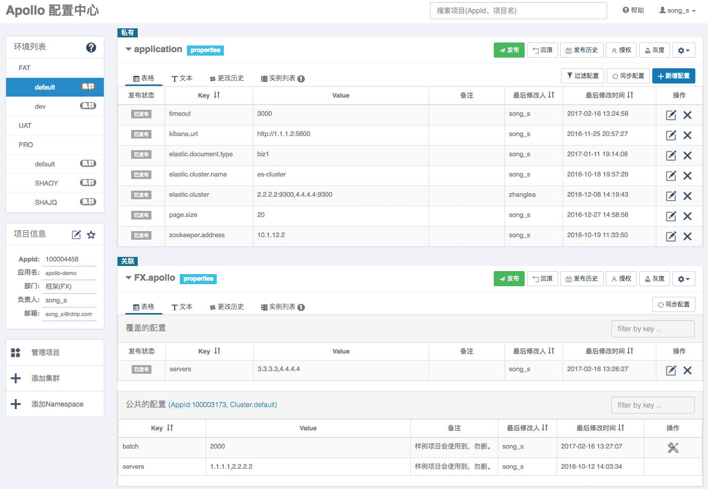
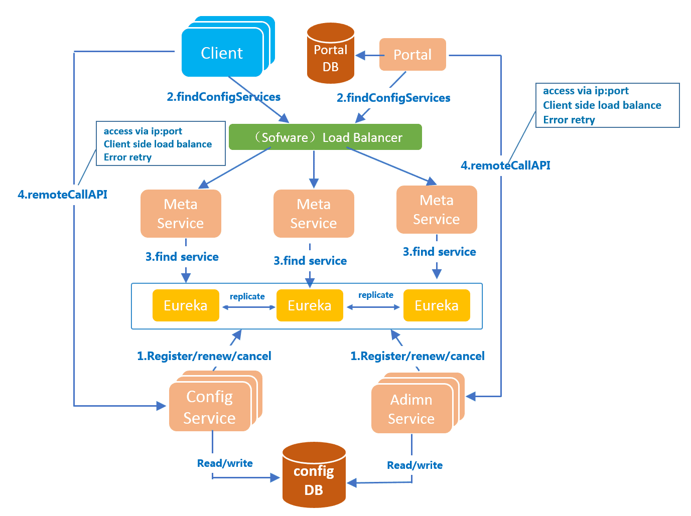
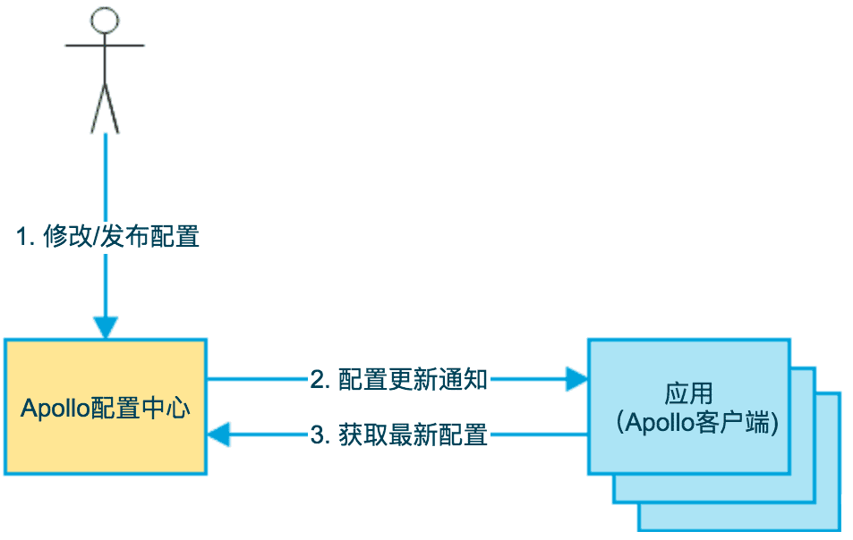

# 一、背景
随着微服务的流行，应用和机器数量急剧增长，程序配置也愈加繁杂：各种功能的开关、参数的配置、服务器的地址等等。 同时，我们对程序配置的期望值也越来越高：配置修改后实时生效，灰度发布，分环境、分集群管理，完善的权限、审核机制等等。

在这样的大环境下，传统的通过配置文件、数据库等方式已经越来越无法满足我们对配置管理的需求。

配置中心，应运而生！

通过配置中心，我们可以方便地管理微服务在不同环境中的配置，从而可以在运行时动态调整服务行为，真正实现配置即『控制』的目标。 所以，在一定程度上，配置中心就成为了微服务的大脑，如何用好这个大脑，让微服务更『智能』，也就成为了一项比较重要的议题。

# 二、实现方案
## 2.1 概述
鉴于配置对程序正确运行的重要性，配置的治理就显得尤为重要：

1. **权限控制、审计日志** 

    由于配置能改变程序的行为，不正确的配置甚至能引起灾难，所以对配置的修改必须有比较完善的权限控制。同时也需要有一套完善的审计机制，能够方便地追溯是谁改的配置、改了什么、什么时候改的等等。

2. **灰度发布、配置回滚** 

    对于一些比较重要的配置变更，我们一般会倾向于先在少量机器上修改看看效果，如果没问题再推给所有机器。同时如果发现配置改得有问题的话，需要能够方便地回滚配置。

3. **不同环境、集群管理** 

    同一份程序在不同的环境（开发，测试，生产）、不同的集群（如不同的数据中心）经常需要有不同的配置，所以需要有完善的环境、集群配置管理。

## 2.2 方案介绍 - Apollo

如前面所论述的：配置需要治理，所以配置中心需要具备完善的治理能力，比如：

1. 统一管理不同环境、不同集群的配置
1. 支持灰度发布
1. 支持已发布的配置回滚
1. 完善的权限管理、操作审计日志

在众多的开源产品中，Apollo 完美的满足了我们的需求。

Apollo（阿波罗）是携程框架部研发并开源的一款生产级的配置中心产品，它能够集中管理应用在不同环境、不同集群的配置，配置修改后能够实时推送到应用端，并且具备规范的权限、流程治理等特性，适用于微服务配置管理场景。

Apollo目前在国内开发者社区比较热，在Github上有超过5k颗星，在国内众多互联网公司有落地案例，可以说Apollo是目前配置中心产品领域Number1的产品，其成熟度和企业级特性要远远强于Spring Cloud体系中的Spring Cloud Config产品。

**项目地址：** [https://github.com/ctripcorp/apollo](https://github.com/ctripcorp/apollo)

## 2.3 Apollo架构和模块

### 2.3.1 四个核心模块及其主要功能
1. ConfigService

    - 提供配置获取接口
    - 提供配置推送接口
    - 服务于Apollo客户端

2. AdminService

    - 提供配置管理接口
    - 提供配置修改发布接口
    - 服务于管理界面Portal

3. Client

    - 为应用获取配置，支持实时更新
    - 通过MetaServer获取ConfigService的服务列表
    - 使用客户端软负载SLB方式调用ConfigService

4. Portal

    - 配置管理界面
    - 通过MetaServer获取AdminService的服务列表
    - 使用客户端软负载SLB方式调用AdminService

### 2.3.2 三个辅助服务发现模块

1. Eureka

    - 用于服务发现和注册
    - Config/AdminService注册实例并定期报心跳
    - 和ConfigService住在一起部署

2. MetaServer

    - Portal通过域名访问MetaServer获取AdminService的地址列表
    - Client通过域名访问MetaServer获取ConfigService的地址列表
    - 相当于一个Eureka Proxy
    - 逻辑角色，和ConfigService住在一起部署

3. NginxLB

    - 和域名系统配合，协助Portal访问MetaServer获取AdminService地址列表
    - 和域名系统配合，协助Client访问MetaServer获取ConfigService地址列表
    - 和域名系统配合，协助用户访问Portal进行配置管理

## 2.4 Apollo配置中心基本概念、特性

### 2.4.1 配置的几个属性

1. 配置是独立于程序的只读变量

    配置首先是独立于程序的，同一份程序在不同的配置下会有不同的行为。

    其次，配置对于程序是只读的，程序通过读取配置来改变自己的行为，但是程序不应该去改变配置。

    常见的配置有：DB Connection Str、Thread Pool Size、Buffer Size、Request Timeout、Feature Switch、Server Urls等。

2. 配置伴随应用的整个生命周期

    配置贯穿于应用的整个生命周期，应用在启动时通过读取配置来初始化，在运行时根据配置调整行为。

3. 配置可以有多种加载方式

    配置也有很多种加载方式，常见的有程序内部hard code，配置文件，环境变量，启动参数，基于数据库等。

4. 配置需要治理

    - 权限控制

        由于配置能改变程序的行为，不正确的配置甚至能引起灾难，所以对配置的修改必须有比较完善的权限控制。

    - 不同环境、集群配置管理

        同一份程序在不同的环境（开发，测试，生产）、不同的集群（如不同的数据中心）经常需要有不同的配置，所以需要有完善的环境、集群配置管理。

    - 框架类组件配置管理

        还有一类比较特殊的配置 - 框架类组件配置，比如CAT客户端的配置。

        虽然这类框架类组件是由其他团队开发、维护，但是运行时是在业务实际应用内的，所以本质上可以认为框架类组件也是应用的一部分。

        这类组件对应的配置也需要有比较完善的管理方式。

### 2.4.2 Apollo配置中心特性
1. 统一管理不同环境、不同集群的配置

    Apollo提供了一个统一界面集中式管理不同环境（environment）、不同集群（cluster）、不同命名空间（namespace）的配置;

    同一份代码部署在不同的集群，可以有不同的配置，比如zk的地址等;

    通过命名空间（namespace）可以很方便的支持多个不同应用共享同一份配置，同时还允许应用对共享的配置进行覆盖。

2. 配置修改实时生效（热发布）

    用户在Apollo修改完配置并发布后，客户端能实时（1秒）接收到最新的配置，并通知到应用程序。

3. 版本发布管理

    所有的配置发布都有版本概念，从而可以方便地支持配置的回滚。

4. 灰度发布

    支持配置的灰度发布，比如点了发布后，只对部分应用实例生效，等观察一段时间没问题后再推给所有应用实例。

5. 权限管理、发布审核、操作审计

    应用和配置的管理都有完善的权限管理机制，对配置的管理还分为了编辑和发布两个环节，从而减少人为的错误；

    所有的操作都有审计日志，可以方便的追踪问题。

6. 客户端配置信息监控

    可以在界面上方便地看到配置在被哪些实例使用。

7. 提供Java和.Net原生客户端

    提供了Java和.Net的原生客户端，方便应用集成；

    支持Spring Placeholder, Annotation和Spring Boot的ConfigurationProperties，方便应用使用（需要Spring 3.1.1+）；

    同时提供了Http接口，非Java和.Net应用也可以方便的使用。

8. 提供开放平台API

    Apollo自身提供了比较完善的统一配置管理界面，支持多环境、多数据中心配置管理、权限、流程治理等特性；

    不过Apollo出于通用性考虑，对配置的修改不会做过多限制，只要符合基本的格式就能够保存；

    在我们的调研中发现，对于有些使用方，它们的配置可能会有比较复杂的格式，而且对输入的值也需要进行校验后方可保存，如检查数据库、用户名和密码是否匹配；

    对于这类应用，Apollo支持应用方通过开放接口在Apollo进行配置的修改和发布，并且具备完善的授权和权限控制。

9. 部署简单

    配置中心作为基础服务，可用性要求非常高，这就要求Apollo对外部依赖尽可能地少；

    目前唯一的外部依赖是MySQL，所以部署非常简单，只要安装好Java和MySQL就可以让Apollo跑起来；

    Apollo还提供了打包脚本，一键就可以生成所有需要的安装包，并且支持自定义运行时参数。

## 2.5 Apollo配置中心运行流程

- 用户在配置中心对配置进行修改并发布
- 配置中心通知Apollo客户端有配置更新
- Apollo客户端从配置中心拉取最新的配置、更新本地配置并通知到应用

