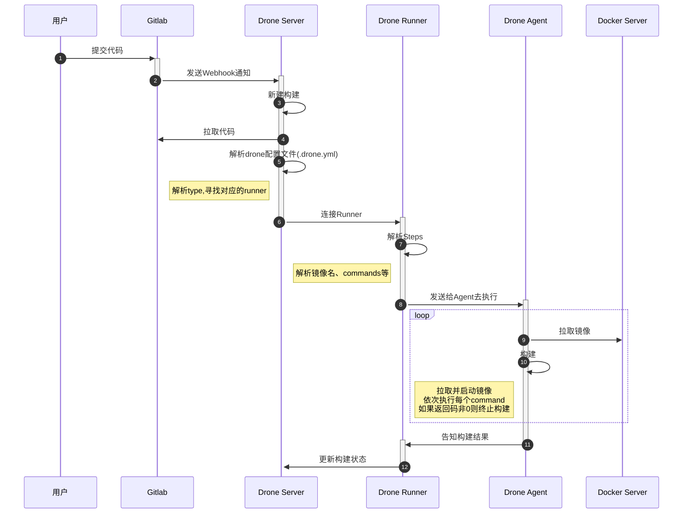
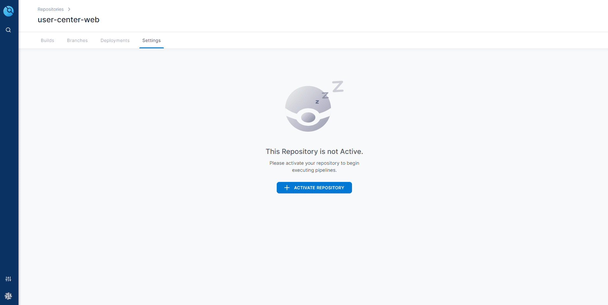
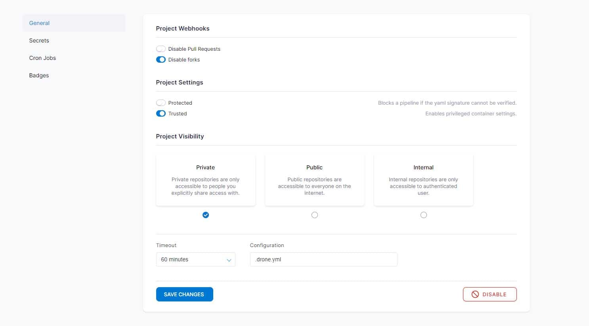
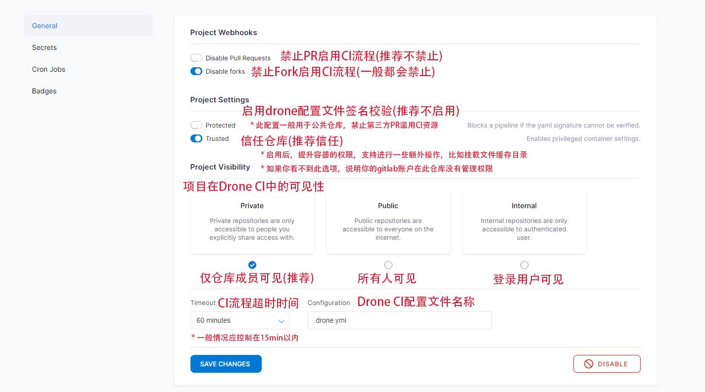
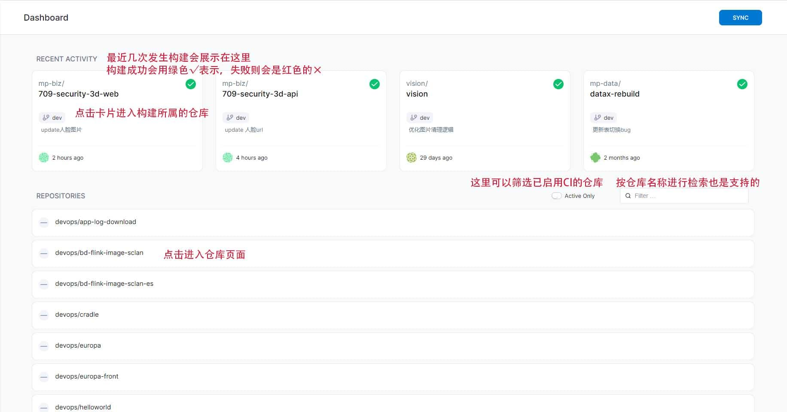
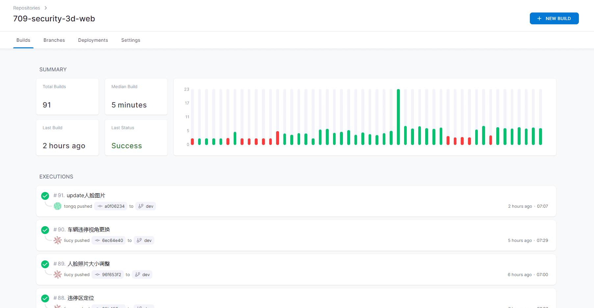
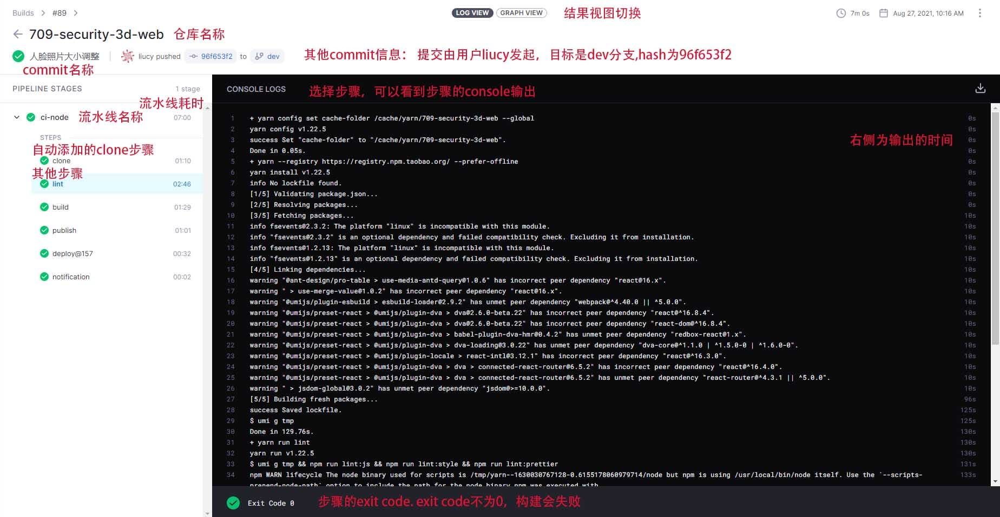
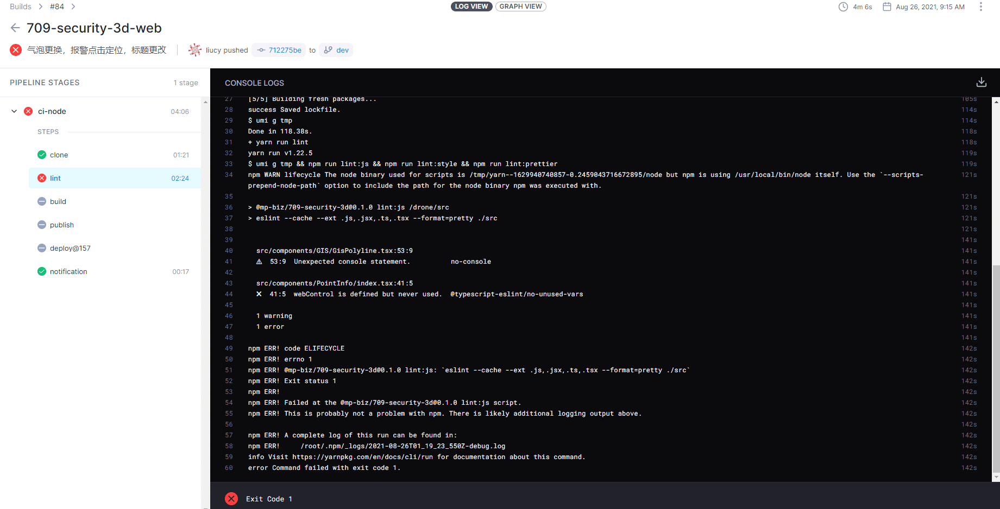
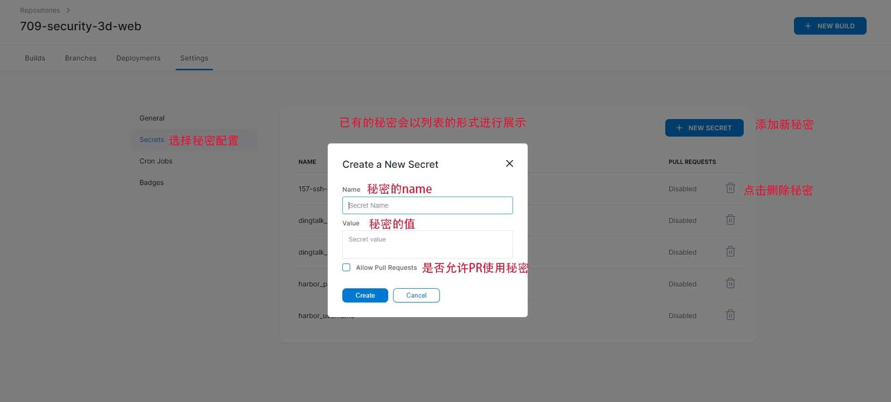

# Drone CI 使用手册


## Drone CI 简介

Drone CI 是一个现代化的持续集成和持续交付平台，可以简单的实现软件的流水线化测试、编译、部署。


## 前提

本文对读者作出以下假设：

- 具有较为丰富的 git 使用经验
- 可以熟练的操作某种 git 服务平台，如 gogs、github、gitlab …. 本文以gitlab为例
- 具有一定的 linux 和 docker 的知识储备和操作经验
- 或许也会使用 docker-compose

环境配置

- 本文使用 GItlab 为例
- drone 为当前最新版：2.1.x

## 原理

> 个人观点，仅供参考

| 角色          | 功能                                         |
| ------------- | -------------------------------------------- |
| 用户          |                                              |
| Gitlab        | 代码托管服务                                 |
| Drone Server  | Drone 主服务，提供Web界面                    |
| Drone Runner  | 实现各种操作的执行器，例如ssh、docker、k8s等 |
| Drone Agent   | 操作宿主机 Docker API 的代理程序             |
| Docker Server | 宿主机的 Docker 程序                         |



## Drone CI安装部署

略

* 可参考162服务器上的/app/drone里的docker-compose.yml文件


## 快速开始

下文会详细描述如何为一个gitlab仓库添加CI功能

### Gitlab配置

1. 确认你有仓库的管理权限**Maintainer**
2. 在Gitlab的人员配置页面(`Settinges->Members`)中添加`drone-ci`用户，确保其权限为**Maintainer**

### Drone CI Server 配置

* Drone CI Server地址: `http://drone.software.dc/`

#### 1. 登录Drone CI Server

当前支持的登录方式: **使用内网Gitlab账号登录**

* 如果你已登录内网Gitlab，会进行自动登录
* 如果你未登录内网Gitlab，会自动跳转到内网Gitlab登录页面，登录成功后会跳转回Drone CI Server页面

如何切换Drone CI账户

* 先切换内网Gitlab账户
* 再去Drone CI Server中执行登出操作
* 重新登录Drone CI Server

#### 2. 开启CI功能

* 在Drone CI Server主界面中找到你的仓库
  * 如果没有找到，执行右上角的SYNC按钮，等其同步完成后再试一试
  * 如果还是没有，**确认当前账户是否有仓库的管理权限**

* 首次进入时，点击ACTIVATE REPOSITORY开启CI功能



* 开启后界面如下，若需要关闭CI功能，点击右下角的DISABLE按钮即可



#### 3. 配置说明



### 仓库添加Drone CI 配置文件

#### 配置文件示例

* 仓库根目录下新建`.drone.yml` 配置文件， 我们以709-security-3d-web仓库里的配置为例进行说明
  * 示例不可能覆盖到全部的配置项，完整的配置说明请参考[官方文档](https://docs.drone.io/pipeline/docker/syntax/)

```yml
# 配置类型，填固定值 pipeline 流水线
kind: pipeline
# CI执行器类型 我们通常使用docker, 其他类型的配置文件内容可能会有不同，请参考官方文档
type: docker
# 流水线名称
name: ci-node

# 存储挂载，可选
# 必须信任仓库后才能使用此功能
# 这里将Drone CI服务器上的/app/drone/cache目录挂载到CI环境中，命名为cache
volumes:
  - name: cache
    host:
      path: /app/drone/cache
      

# 流水线的自定义步骤
# 在执行自定义步骤前，系统会首先执行了一个步骤git clone，将仓库clone到CI环境中，并切换到当前提交的branch
# 如果需要修改clone步骤的默认行为，请参考官方文档
steps:
  # 步骤1 此步骤命名为lint
  - name: lint
  # 使用  docker官方的node镜像 
    image: node:14-alpine
  # 将前文的cache挂载到镜像内的/cache文件夹
    volumes:
      - name: cache
        path: /cache
    # 在此步骤内执行的命令
    # 1. 设置缓存文件夹，注意缓存文件夹位于前文挂载的/cache目录内，这样会被持久化到Drone Server，下次可以复用
    #    此步骤是为了缓存代码的依赖，避免每次执行CI构建都需要重新从网上下载
    # 2. 下载依赖，优先使用本地缓存
    # 3. 执行代码格式检查
    commands:
      - yarn config set cache-folder /cache/yarn/709-security-3d-web --global
      - yarn --registry https://registry.npm.taobao.org/ --prefer-offline
      - yarn run lint
    # 步骤1执行条件
    when:
      # 仅针对dev和master分支
      branch:
        - dev
        - master
  #步骤2 以下只会列出前文没有的配置
  - name: build
    image: node:14-alpine
    commands:
      - yarn run build
      # 此命令执行了一个自定义脚本，其用处是在根目录下生成了一个.tags文件，里面是以逗号(,)分隔的Docker Tag,方便后续发布
      # 示例:    echo "1.0.0,latest" > .tags
      - yarn run docker:gen-tags
    when:
      # 仅构建状态为成功时执行
      # 对流水线的每个步骤的每个指令，只要其返回值不为0，整个流水线就会被认为失败(failure)
      status:
        - 'success'
      branch:
        - dev
        - master
  # 步骤3 发布镜像
  - name: publish
    # 使用drone官方的docker插件，可以往指定docker仓库里发布镜像
    image: plugins/docker
    # 插件的配置，每个插件的都可能有其独特的配置，具体需要查看插件文档
    settings:
      # 发布的docker仓库地址，如果你是往docker官方仓库发布，此配置可忽略，这里填的是我们的内网Docker仓库
      registry: harbor.software.dc
      # 发布docker repo地址，如果你是往docker官方仓库发布，harbor.software.dc/可以省略掉
      repo: harbor.software.dc/709-security-3d/web
      # Docker仓库登录的用户名，注意这里用了一个配置'from secret'，表明配置的值是从秘密里获取的，这里先跳过，后文会进行详细描述
      username:
        from_secret: harbor_username
      # Docker仓库登录的密码,同样是从秘密里获取的
      password:
        from_secret: harbor_password
      # 其他配置项等，下略
      insecure: true
      custom_dns: 172.18.8.161
      mirror: https://ek23kius.mirror.aliyuncs.com
    when:
      status:
        - 'success'
      branch:
        - dev
        - master
  # 步骤4 在157服务器上进行自动部署
  - name: deploy@157
  # 这里使用了一个第三方开发者编写的插件，能通过ssh远程执行shell命令
    image: appleboy/drone-ssh
    settings:
      host: 172.18.8.157
      username: ljgk
      password:
        from_secret: 157-ssh-password
      port: 22
      # 执行的命令列表
      # 1. 进入/app/709-security3d目录
      # 2. 拉取最新镜像，这个镜像是步骤3中发布的
      # 3. 重新部署
      script:
        - cd /app/709-security3d
        - /usr/local/bin/docker-compose pull web
        - /usr/local/bin/docker-compose up -d
    when:
      status:
        - 'success'
      branch:
        - dev
        - master
  # 步骤5 钉钉推送构建结果
  - name: notification
    # 这里也是一个第三方开发者编写的插件
    image: lddsb/drone-dingtalk-message
    settings:
      token:
        from_secret: dingtalk_token
      secret:
        from_secret: dingtalk_secret
      type: markdown
      success_color: 008000
      failure_color: FF0000
      message_color: true
      message_pic: true
    when:
      # 这里status包括failure，表明此步骤在流水线失败时也会执行
      status:
        - 'failure'
        - 'success'

```


#### 构建结果查看

* 在配置正确的情况下，当仓库里包含`.drone.yml` 配置文件后，构建会自动开始执行

* 登录进入Drone CI Server，在首页选择仓库点击进入



* 仓库页面示例如下，上方是一些统计信息，下方是具体的构建列表，点击进入构建详情



* 成功示例

  

* 失败示例

  * 注意失败时，发生错误后的部分步骤被跳过了
  * 可以通过失败步骤的console输出查找失败原因，进行修改

  


## 高级功能

### 秘密

* 有时我们不希望在DroneCI配置文件中暴露某些敏感信息，如用户名、密码、RSA key等等，此时需要使用秘密功能

#### 配置秘密

* 在 Drone CI Server的仓库的配置页面中去进行秘密的配置（Repositories - Settings - Secrets)
  * 注意，秘密的值，一经设定后便**无法查看和更改**，如要更新秘密，只能删除后重新添加



#### 使用秘密

* 示例如下

```yml 

steps:
  - name: example
    image: xxx
    # 演示在配置中使用秘密
    settings: 
      # 正常使用
      username1: 123456
      username2:
        # harbor_username为配置的秘密的name
        from_secret: harbor_username
    # 演示在指令中使用秘密
    environment:
      # 先将秘密注入到环境变量中
      USERNAME:
        from_secret: harbor_username
    commands:
      # 在指令中使用环境变量
      # 注意在yml中$符号需要使用$$进行转义,
      - echo $${USERNAME}
    
```

## 参考链接

* [Drone官方文档首页](https://docs.drone.io/)
* [Drone官方插件列表](http://plugins.drone.io/)

