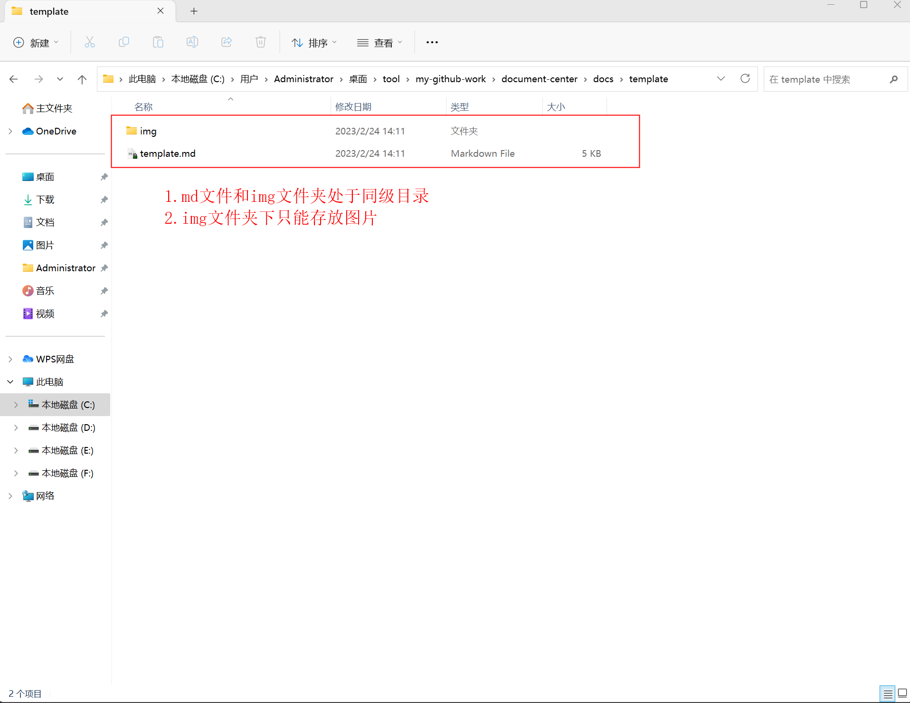

# markdown 语法模板

## 文字

- _斜体文本_
- **粗体文本**
- **_粗斜体文本_**
- <font color="#D1EEEE" size="6">带颜色的文字</font>
- <font color="blue">**_复杂文字_**</font>
```
属性：
- size: 1~10
- color: 16进制 | 英文
<font color="#D1EEEE" size="6">带颜色的文字</font>
<font color="blue">**_复杂文字_**</font>
```

## 线

- ~~删除线~~
- <u>下划线</u>

## 列表

1. 列表 1
   - 列表 1-1
   - 列表 1-2
2. 列表 2
   - 列表 2-1
   - 列表 2-2

- 列表 3
  - 列表 3-1
  - 列表 3-2

## 区块

> 最外层
>
> > 第一层嵌套
> >
> > > 第二层嵌套

## 代码片段

```
const temp = "代码片段";
function func(){
   console.log("test");
}
```

## 链接

[百度](http://www.baidu.com)

## 图片



```
- 文件如上图存放: 
- 语法：
   - 本地图片： ![图片名称][图片相对路径]
   - 网络图片： ![图片名称][网络路径]
- 暂不支持加载http图片
```

## 表格

| 表头   | 表头   |
| ------ | ------ |
| 单元格 | 单元格 |
| 单元格 | 单元格 |
