# 视频监控智能分平台使用说明书

项目地址：[http://172.18.8.172/](http://localhost:8000，直接访问地址即可

[TOC]

# **一、主页介绍**

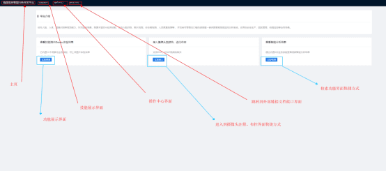

菜单栏：

视频监控智能分析平台

技能展示

操作中心

使用文档

1. 点击“视频监控智能分析开发平台”按钮，回到主页，默认主页。

2.  点击“技能展示”按钮，跳转到技能展示界面

3. 点击“操作中心”按钮，跳转到操作中心界面

4. 点击“使用文档”，跳转到外部使用文档界面

三个界面分别如下：

技能展示：

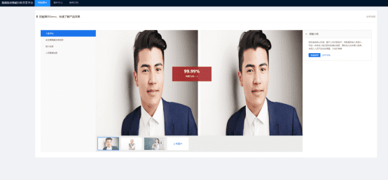

操作中心：

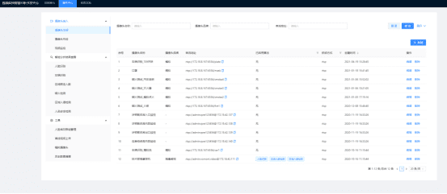

 

使用文档：

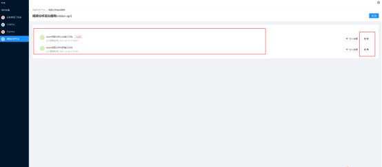

 

其他三个按钮分别对应具体的相应的业务列表,点击之后界面分别如下:

查看技能演示Demo,体验效果

接入摄像头视频流，进行布控

 

查看智能分析结果

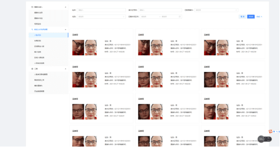

 

# 二、**技能展示**

 

技能展示目前提供的有人脸对比，安全帽佩戴合规检测、烟火检测、人员聚集检测

人脸提供默认的人脸，可以通过上传图片与默认图片进行对比，获得相似度其，其他业务如下展示：

## **2.1、人脸对比**

默认对比图片如下所示

 

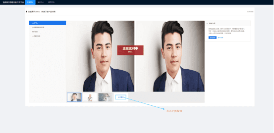

 

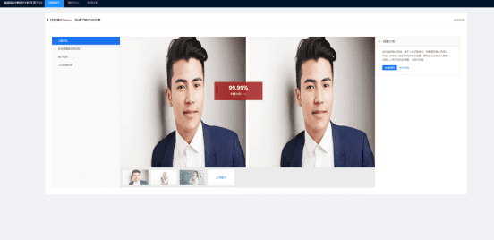

如果上传了与原始图片人不一样的图片，系统会返回结果

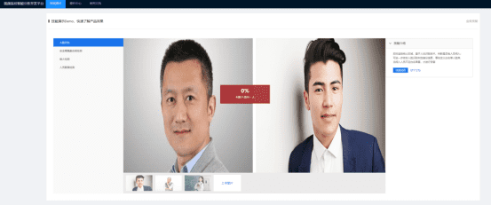

 

## **2.2、安全帽佩戴合规检测**

安全帽佩戴合规检测中，会将整个人脸以及轮廓标记出来

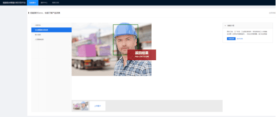

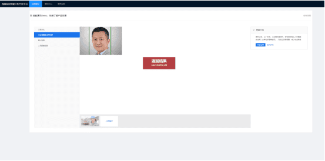

## **2.3、烟火检测**

烟火检测，会将上传图片中的烟火范围通过绿色的方框圈出来

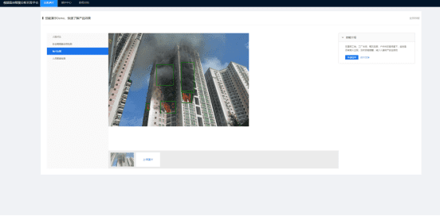

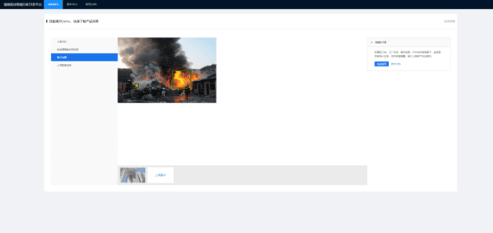

 

## **2.4、人员聚集检测**

人员聚集检测目前支持稀疏人群的检测，如果是密度很大的聚集人群，这种情况下比较适合统计人数变化趋势。

### **2.4.1、人员稀疏场景：**

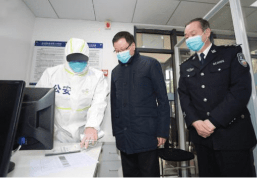

检测结果正确如下图所示：

​                                                     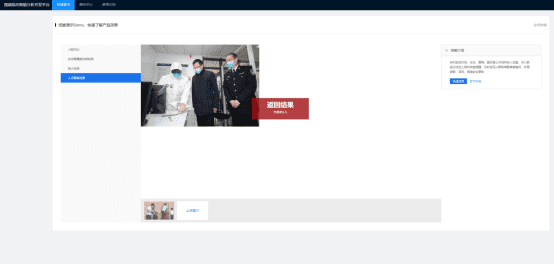

 

### **2.4.2、人员聚集密集的场景：**

检测结果如下图所示，这种场景的情况下比较适合人员聚集密度变化率

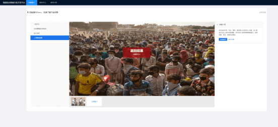

 

### **2.4.3、人种方面**

该算法训练采取亚洲人训练的，因此提供的图片最好仅仅包含亚洲人。

​                                                                       

检测结果会出现误差

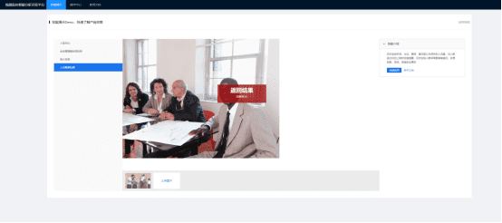

 

# 三、操作中心

操作中心分为以下几个大模块：

-  摄像头接入

-  智能分析结果查看

-  工具

## **3.1、摄像头接入**

### **3.1.1、摄像头注册**

 

​																		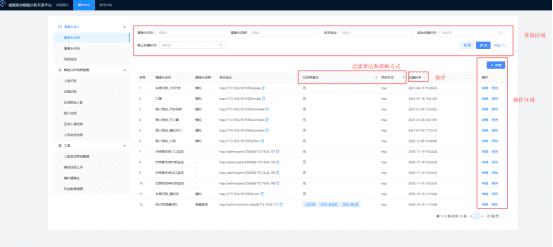 

 

说明：

1、其中摄像头名称、摄像头品牌、串流地址这些都是模糊查询、起始截时间是根据摄像头的创建时间来进行过滤

2、启用算法和抓帧方式可以通过列表上面的过滤图标选择进行过滤

3、创建时间可以选择升序或者降序

 

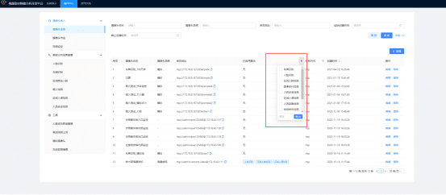

编辑界面如下所示：

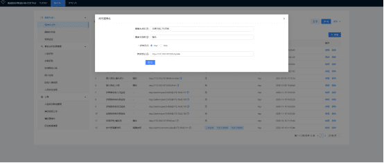

### 3.1.2、摄像头布控

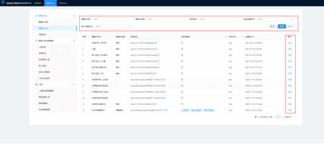

 

基本操作与摄像头注册一样

 

布控界面如下所示：

智能监控：

开启：代表已经启用这个摄像头进行监控

关闭：代表不启用这个摄像头进行监控

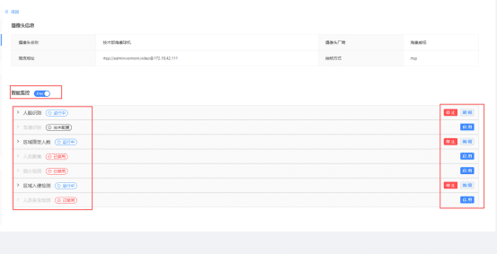

其中对于每一项服务分别有启用状态和非启用状态

 

***\*人脸识别：\****

1.  抽帧频率：从视频流里抽取图片的频率

2.  相似度阈值：相似度的一个得分，如果低于这个得分将会被忽略

3.  最小识别人脸尺寸：暂时未使用

4. 水平转角：指人脸转动的角度

5. 俯仰角：人脸向上或者向下的角度

6. 倾斜角：人脸在整个平面内的转动角度

7.  人脸识别群组：匹配人脸库

8. 识别区域：可以选择范围，默认是全屏，也可以通过滑动鼠标圈定区域

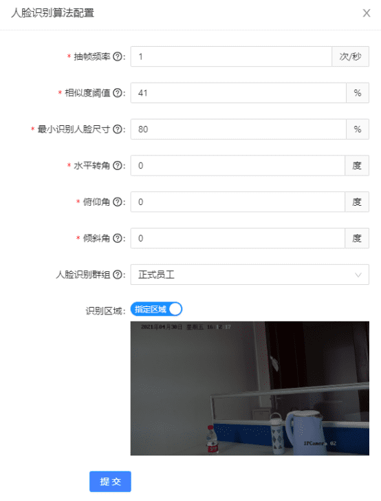

 

 

滑动鼠标选择区域

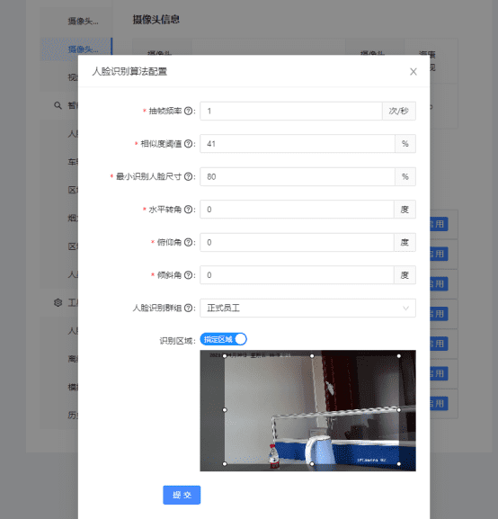

 

 

 

***\*车牌识别：\****

1. 抽帧频率：从视频流里抽取图片的频率

2. 汽车相似度阈值：算法匹配汽车得分，低于填写分数会被忽略

3. 车牌相似度阈值：算法计算车牌相似度，如果低于填写得分会被忽略

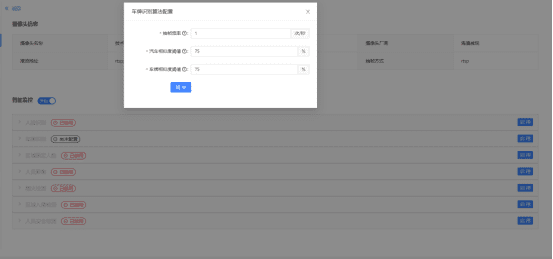

 

***\*区域限定人数：\****

1.  抽帧频率：从视频流里抽取图片的频率

2. 相似度阈值：人脸对比相似度低于该值会被忽略

3. 限定最高人数：规范区域范围内的最高人数

4. 限定最低人数：规范最低人数

5. 聚集后报警时长：超过最高人数，报警时长设置

6. 识别区域：默认全屏，可以通过滑动鼠标选择范围

​														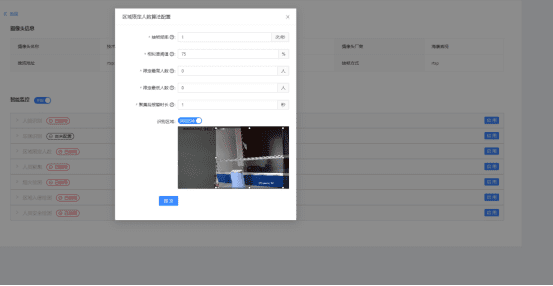 

 

 

***\*人员聚集：\****

 

***\*烟火检测：\****

抽帧频率：从视频流里抽取图片的频率

烟雾阈值：烟的检测识别相似度低于该值会被抛弃

火焰阈值：火的检测识别相似度低于该值会被抛弃

 

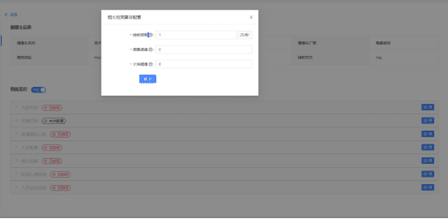

 

***\*区域入侵检测：\****

抽帧频率：从视频流里抽取图片的频率

检测类型：分为进入和离开

识别区域：默认全屏，可以通过滑动鼠标选择范围

 

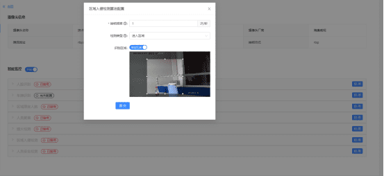

 

***\*人员安全检测：\****

抽帧频率：从视频流里抽取图片的频率

是否带安全帽：检测安全帽功能开启与否

是否带护目镜：检测护目镜功能开启与否

是扩带口罩：检测口罩功能开启与否

是否规范着装：检测着装是否规范功能是否开启

 

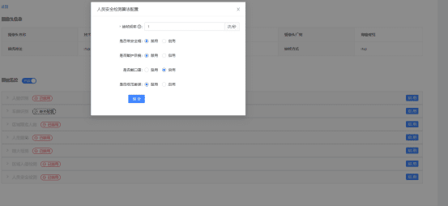

 

 

 

### **3.1.3、视频监控**

左边：设备列表

下拉选择框：该设备的监控功能选择

右上角控制设备监控路数：分别为单个、四个、六个、九个

 

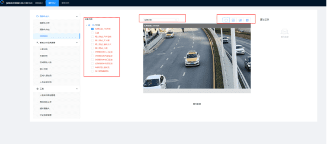

 

切换设备列表

 

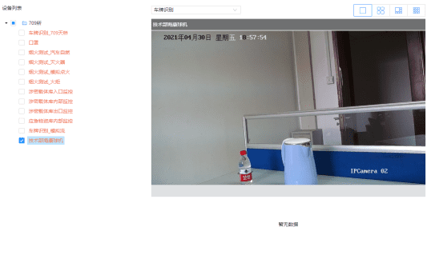

 

切换视频路数

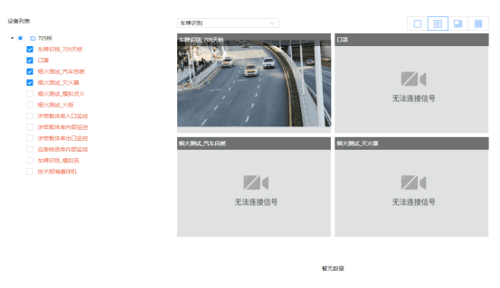

## **3.2、智能分析结果查看**

人脸识别

可以根据姓名、身份证号码、匹配摄像头、性别、时间区间进行查询

 

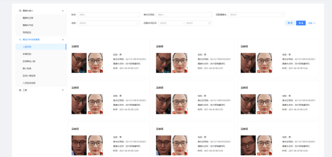

 

车辆识别、区域限定人数、烟火检测、区域入侵检测、人员安全检测同人脸识别

 

## **3.3、工具**

### **3.3.1、人脸库以及群组管理**

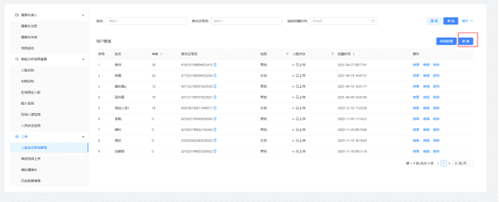

点击新建按钮，进入新增人员界面，填写人员基本信息

 

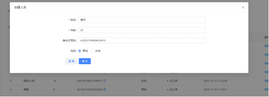

 

新建人员完毕之后，选中该人员，点击***\*查看\****，在新界面添加人员的人脸照片

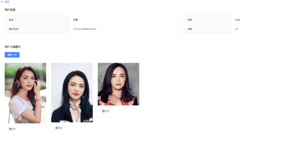

 

 

点击群组管理，进入到群组管理界面

该界面有个按钮可以回到人***\*脸库\****管理界面

其中编辑和删除按钮可以对已有群组进行编辑和删除操作

 

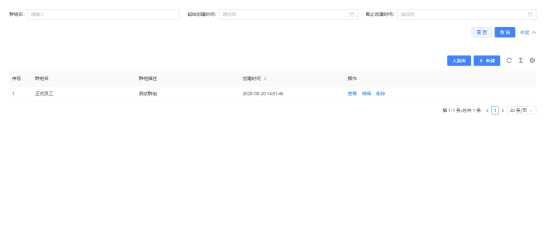

点击***\*查看\****按钮，进入群组详情界面，有该组下所有的员工，操作与员工菜单一致。这些员工的作用就是用来做监控中的人脸对比库

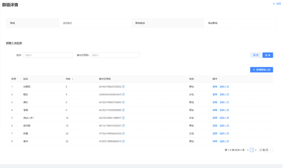

### **3.3.2、离线视频上传**

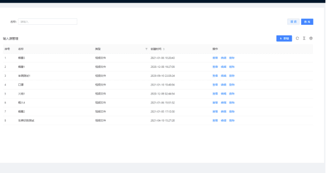

该菜单的目的是为了在没有真实监控视频的情况下用来模拟监控视频。

点击***\*新建\****

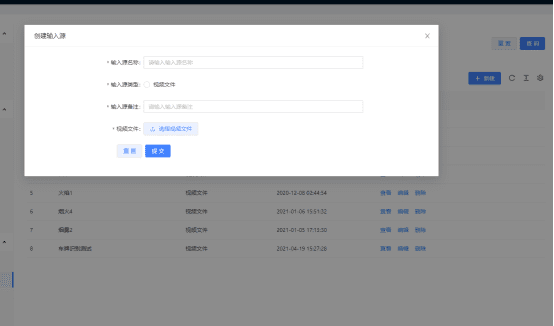

 

将本地视频（可以是一段火灾视频，人流视频，车流视频等等），然后填入输入源名称、备注信息，上传文件，提交则该输入源保存成功。

 

### **3.3.3、模拟摄像头**

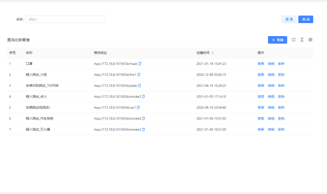

点击***\*新建\****，可以新建一个模拟摄像头（假的）

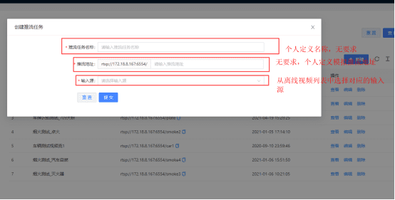

***\*编辑、删除\****按钮可以对该模拟摄像头进行编辑、删除操作

点击***\*查看\****按钮

这是还没有进行推流的情况下：

 

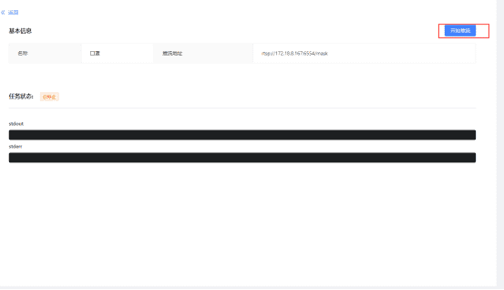

点击***\*开始推流\****

该模拟摄像头就开始循环读取离线视频文件，控制界面可以看到日志

 

到此为止，我们模拟的摄像头对象以及该“摄像头”监控到的视频创建完毕。

只有已经启用的摄像头可以在摄像头布控中开启对应的算法。

### **3.3.4、历史数据清理**

定时自动删除和手动删除

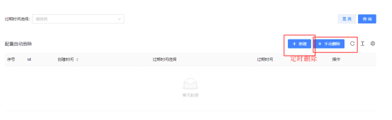

定时自动删除注册

选择完保存周期之后，到期后会将所有的摄像头捕获的图片和数据库记录删除。

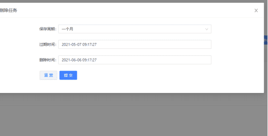

 

手动删除

选择摄像头和删除截止日期。然后就会执行删除该摄像头和

 

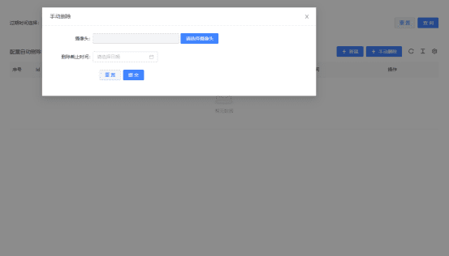

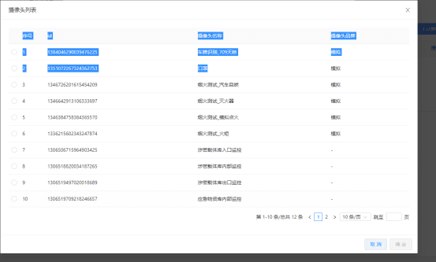

# 四、文档

点击使用文档，进入文档中心之后，就可以看到vision后台接口文档。

​																	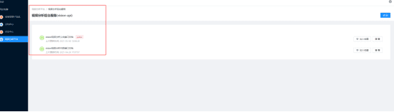 